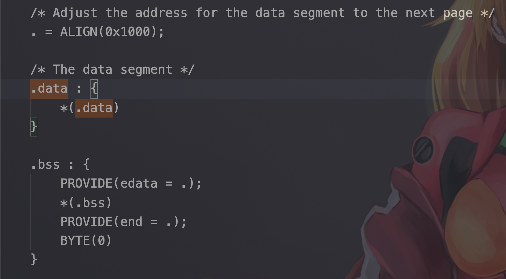
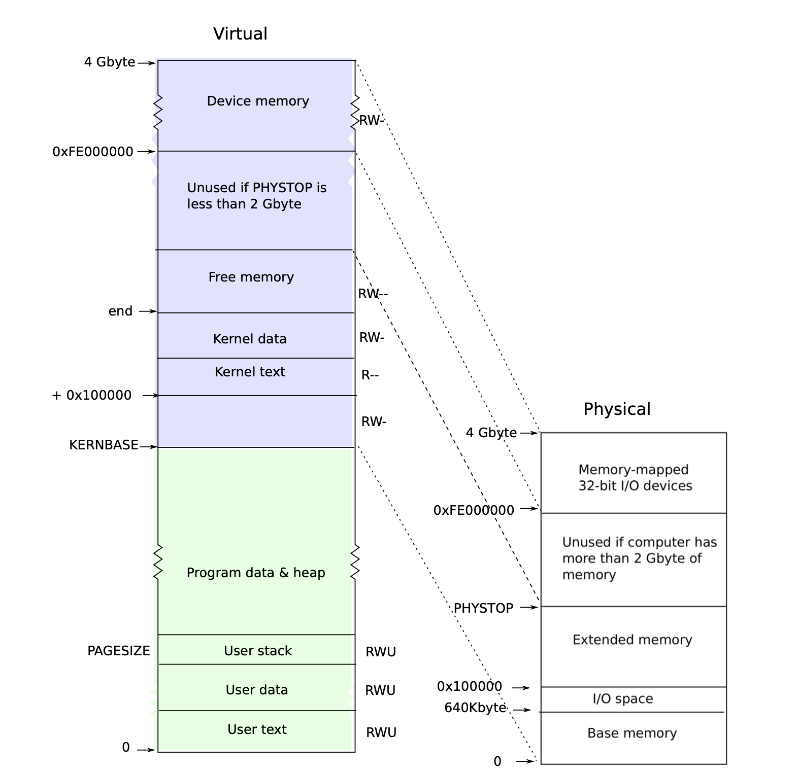
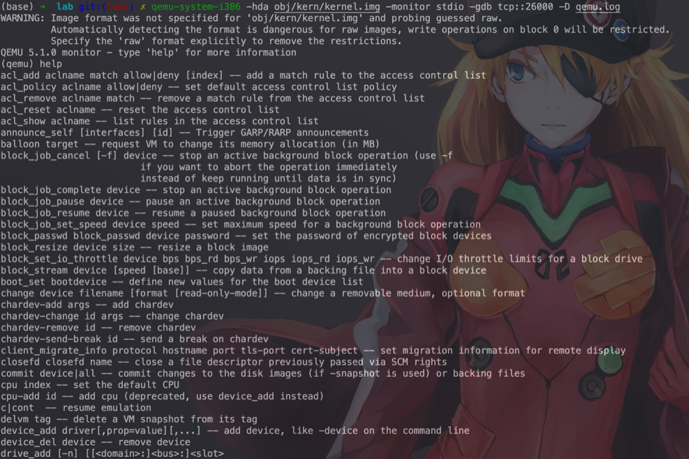
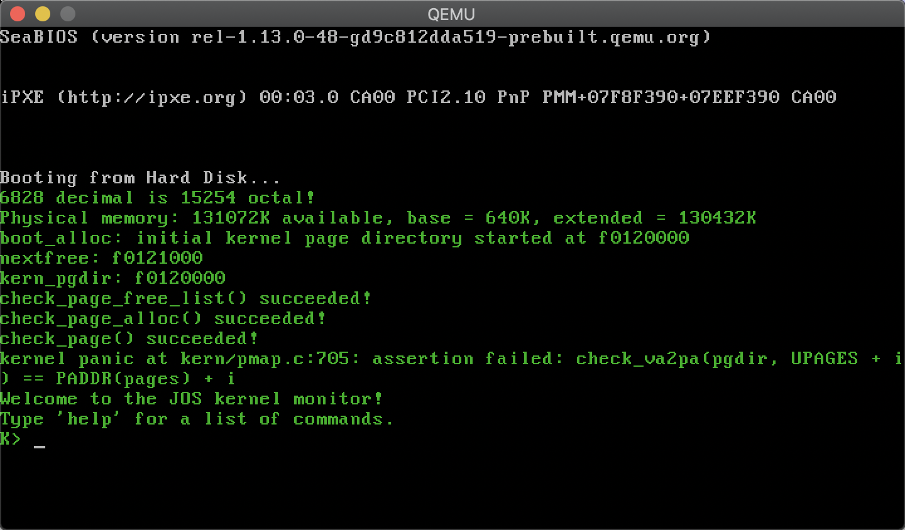
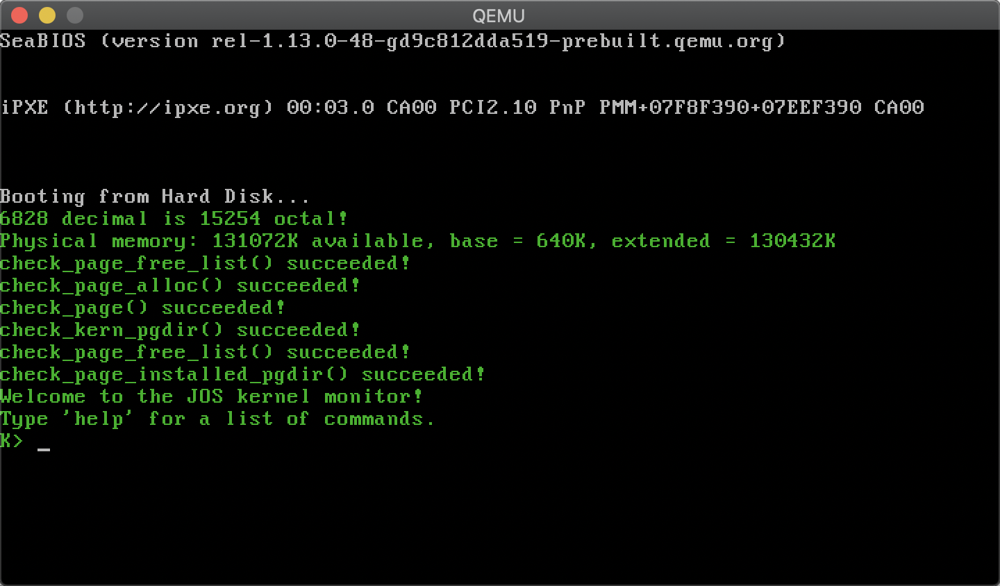
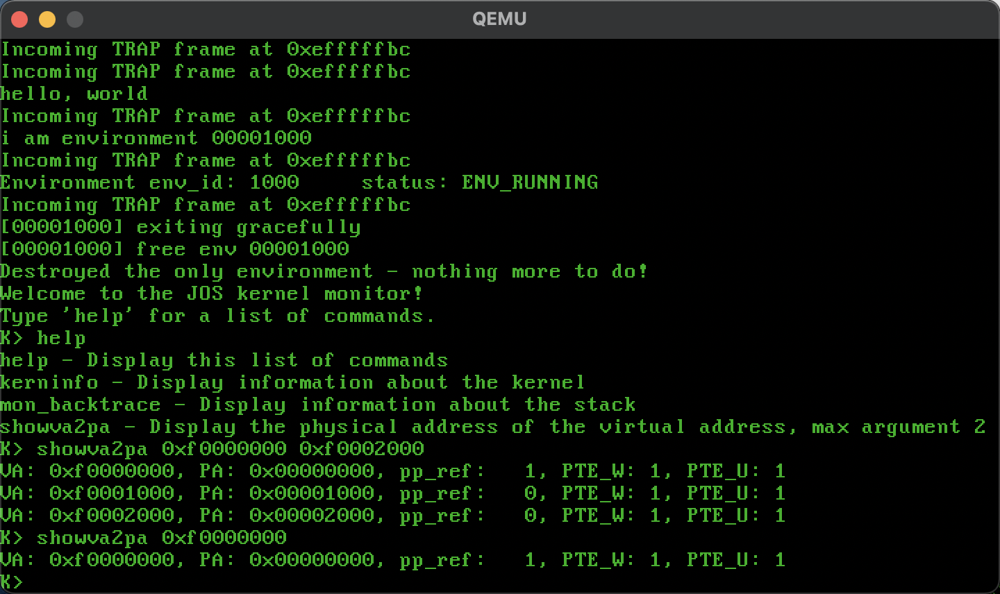
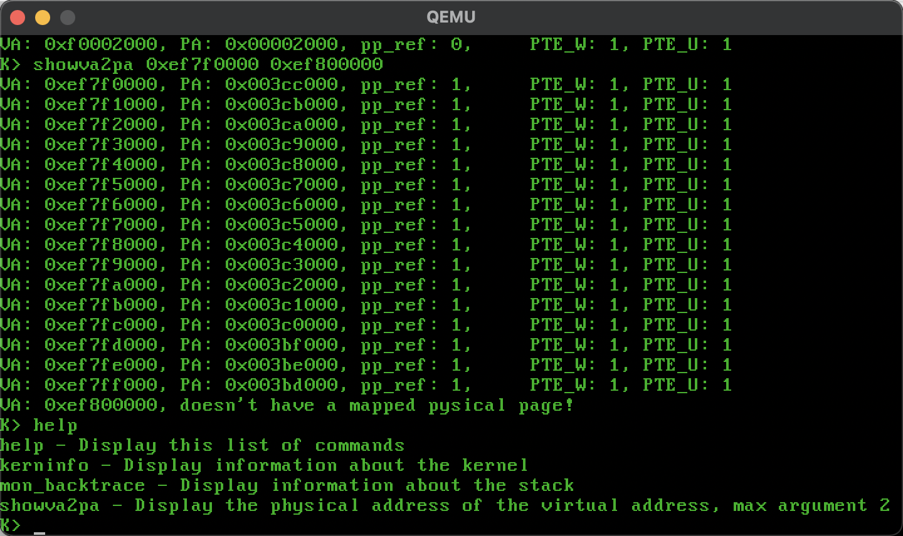
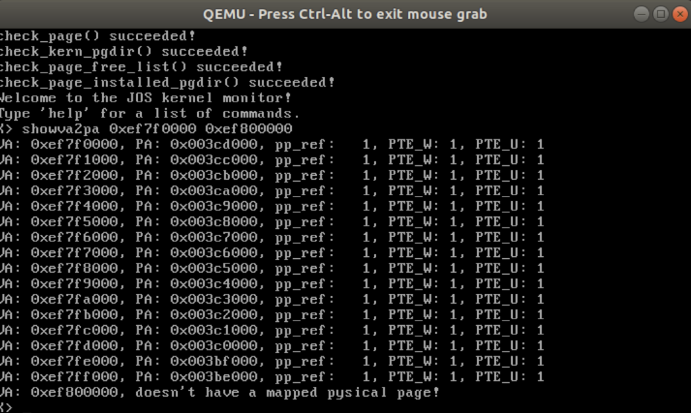
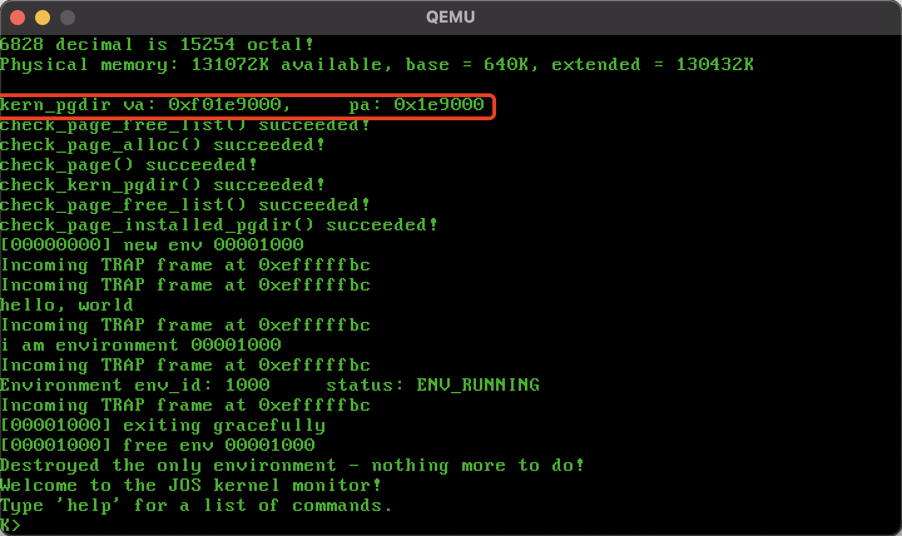
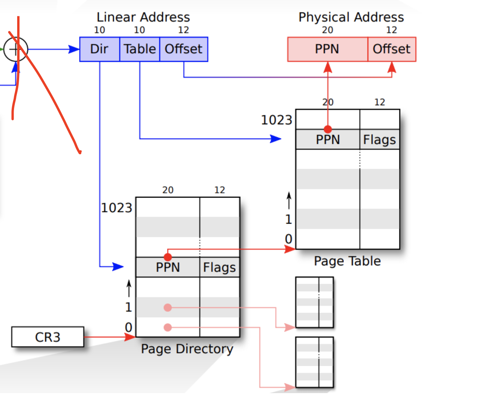

# LAB 2

*by Woooooow~ / start 2020/10/15 /*

## Solution to the Exercise

### Part 1: Physical Page Management

#### Exercise 1

> **Exercise 1.** In the file kern/pmap.c, you must implement code for the following functions (probably in the order given).
>
> `boot_alloc()`
> `mem_init()` (only up to the call to *check_page_free_list(1)*)
> `page_init()`
> `page_alloc()`
> `page_free()`
>
> `check_page_free_list()` and `check_page_alloc()` test your physical page allocator. You should boot JOS and see whether `check_page_alloc()` reports success. Fix your code so that it passes. You may find it helpful to add your own `assert()`s to verify that your assumptions are correct.

##### **boot_alloc()**

一开始看这个函数的时候并不知道他要做什么, 跳过这个函数直接看 mem_init() 后发现他只是用来初始化 page table dirctory ( 只在 kernel 启动的时候调用, 多么短暂的一生啊 ).

这时候我意识到这个函数要解决的是个启动时的套娃问题:

> There is a bootstrap problem: all of physical memory must be mapped in order for the allocator to initialize the free list, but creating a page table with those mappings involves allocating page-table pages. -- *xv6 book 2018*

同样 *xv6 book* 给出了解决方案

> xv6 solves this problem by using a separate page allocator during entry, which allocates memory just after the end of the kernel’s data segment. This allocator does not support freeing and is limited by the 4 MB mapping in the entrypgdir, but that is sufficient to allocate the first kernel page table. -- *xv6 book 2018*

这个函数有两个让我非常头疼的问题 ( 虽然这就是他要我们去思考的问题，嘤嘤嘤 )

- How to allowcate chunks of *contiguous physical* memory?
- How to detect how may pysical memory left?

这个函数是在初始化 page directory 的时候被调用, 即 `mem_init()` 中调用, 用于从物理内存中取出 4k Bytes 作为初始的 page table. 在此之前, `mem_init()` 还调用了 `i386_detect_memory()` 函数, 检测环境中有多少可用物理内存空间, 并将结果保存到全局变量 npages 和 npages_basemem 中. 其函数中变量的具体含义如下:

- i386_detect_memory():
  函数功能是检测现在系统中有多少可用的内存空间 ( 物理内存 ), 其中:
  - 0x00000 - 0xA000: basement 可用
  - 0xA0000 - 0x100000: I/O hole 不可用
  - 0x100000 以上为 external memory 可用
  - npages: 记录整个内存的可用的页数
  - npages_basemem: 记录 basement 区域可用页数

再观察要补充完整的函数 `boot_alloc()`, end 是 kernel.ld 直接给的, 如下图 (kernel/kernel.ld:53)
> 
>
> **Figure 2-1**
>
> kernel/kernel.ld:53

标记了可用地址的起始位置. `ROUNDUP` 则是 Round up to the nearest multiple of n. 而 `nextfree` 则用来标记下一个可用 page 的首地址

从而我们可以通过 `ROUNDUP(nextfree + n, PGSIZE)` 来分配连续 pages, 用 `nextfree - KERNBASE > npages * PGSIZE` 判断是否超出内存, 具体实现如下 ( 其中有部分注释是我写代码的时候加的, ~~不要吐槽我垃圾英语了~~ )

```cpp
static void *
boot_alloc(uint32_t n){
    static char *nextfree; // virtual address of next byte of free memory
    char *result;

    // Initialize nextfree if this is the first time.
    // 'end' is a magic symbol automatically generated by the linker,
    // which points to the end of the kernel's bss segment:
    // the first virtual address that the linker did *not* assign
    // to any kernel code or global variables.
    if (!nextfree) {
        // end means the end of the kernel's bss segment,
        // here in i386 we use the small endian,
        // so the 'end' means highest address of the bss segment.
        extern char end[];
        // nextfree point to the next free page (will the start of that page, at low)
        nextfree = ROUNDUP((char *) end, PGSIZE);
    }

    // Allocate a chunk large enough to hold 'n' bytes, then update
    // nextfree.  Make sure nextfree is kept aligned
    // to a multiple of PGSIZE.
    //
    // LAB 2: Your code here.

    // debug message
    cprintf("boot_alloc: initial kernel page directory started at %x", nextfree);

    result = nextfree;
    if (!n)
        nextfree = ROUNDUP(nextfree + n, PGSIZE);
    if (nextfree - KERNBASE > npages * PGSIZE) {
        panic("boot_alloc: out of memory. Requested %uK, available %uK.\n",
        ((uint32_t)nextfree - (uint32_t)result) / 1024, npages * PGSIZE / 1024);
        result = NULL;
    }

    return result;
}
```

##### **page_init()**

在 `mem_init()` 函数初始化 page table directory 通过套娃 *Recursively insert PD in itself as a page table, to form a virtual page table at virtual address UVPT.* 将存放 page table directory 的 page 的映射关系存放到了 page table direcctory 中 (这里具体操作我没有完全理解，所以暂时不做解释), 对应的代码如下:

```cpp
//////////////////////////////////////////////////////////////////////
// Recursively insert PD in itself as a page table, to form
// a virtual page table at virtual address UVPT.
// (For now, you don't have understand the greater purpose of the
// following line.)
// I really coundn't understand how it work.

// Permissions: kernel R, user R
kern_pgdir[PDX(UVPT)] = PADDR(kern_pgdir) | PTE_U | PTE_P;
```

然后函数再次调用 `boot_alloc()` 函数, 在之前的用于存放 page table directory 空间的上面取得了一个用于存放 **kernel** page table entry 的 page (这里我理解了好久才意识到, 这些工作只是初始并管理 kernel 空间的内存, 而此时用户空间的内存暂时没有被管理). 而这里被初始化的 page table entry array 顺序对应整个物理内存 ( where kernel located, 具体对应 Figure 2-2 ):

> 
>
> **Figure 2-2**
>
> From *xv6 book 2018*

对应的实现:

```cpp
pages = (struct PageInfo *) boot_alloc(npages * sizeof(struct PageInfo));
memset(pages, 0, sizeof(struct PageInfo));
```

之后 `mem_init()` 函数调用 `page_init()` 函数进行内存空间页初始化. 而 `page_init()` 函数具体工作则是 1) 将可用的 page 标注, 并以 page_free_list 为 list head 将可用 page 作为 list 连接起来; 2) 将不可用 (或者已经被占用) 的 page 标注.

由题目注释得知, 被占用的 ( 或不可用 ) page 有 page[0]; [IOPHYSMEM, EXTPHYSMEM) 这一段的 I/hO Hole; 以及从 EXTPHYSMEM 开始连续的一段内存 ( 其中包括了 kernel 自身, 以及之前分配的 kernel_pgdir 和 pages ). 从 图 **Figure 2-2** 可以看出 I/O hole 到分配给 PTE 的 page 那块是连续被占用的, 因此可以通过 `((uint32_t) boot_alloc(0) - KERNBASE)` 得到 EXTPHYSMEM 后空闲页的起始位置 ( 还是看图可知, 物理地址 0 被映射到 KERNBASE, 而 `boot_alloc(0)` 则会返回之前分配给 PTE 后下一个可用块的起始虚拟地址, 两者相减除以 PGSIZE 就得到 EXTPHYSMEM 后空闲页的起始位置 ), 具体实现见下:

```cpp
void
page_init(void)
{
    // The example code here marks all physical pages as free.
    // However this is not truly the case.  What memory is free?
    //  1) Mark physical page 0 as in use.
    //     This way we preserve the real-mode IDT and BIOS structures
    //     in case we ever need them.  (Currently we don't, but...)
    //  2) The rest of base memory, [PGSIZE, npages_basemem * PGSIZE)
    //     is free.
    //  3) Then comes the IO hole [IOPHYSMEM, EXTPHYSMEM), which must
    //     never be allocated.
    //  4) Then extended memory [EXTPHYSMEM, ...).
    //     Some of it is in use, some is free. Where is the kernel
    //     in physical memory?  Which pages are already in use for
    //     page tables and other data structures?
    //
    // Change the code to reflect this.
    // NB: DO NOT actually touch the physical memory corresponding to
    // free pages!
    size_t i;
    page_free_list = NULL;

    // calculate the allocatable (or available) memory (page index) in Extended memory
    size_t pgs_avail_extend = ((uint32_t) boot_alloc(0) - KERNBASE) / PGSIZE;

    pages[0].pp_ref = 1;
    pages[0].pp_link = NULL;
    for (i = 1; i < npages_basemem; i++) {
        pages[i].pp_ref = 0;
        pages[i].pp_link = page_free_list;
        page_free_list = &pages[i];
    }
    for (; i < pgs_avail_extend; ++i){
        pages[i].pp_ref = 1;
        pages[i].pp_link = NULL;
    }
    for (; i < npages; ++i){
        pages[i].pp_ref = 0;
        pages[i].pp_link = page_free_list;
        page_free_list = &pages[i];
    }
    return;
}
```

##### **page_alloc()** & **page_free()**

`mem_init()` 调用函数 `check_page_free_list(1)` 将 `page_free_list` list 中的递减的 page 转为递增 ( 如果运行完 `page_init()` 但是 `page_free_list` 存在不应该有的东西, 就会导致疯狂重启. 我试过了, 体验良好, 搞了 2h 才知道是这个函数在逼迫 jos 重启 ), 然后调用 `check_page_alloc()` 函数, 而这个函数会调用我们的 `page_alloc()` 和 `page_free()` 函数, 如果测试成功就返回 ‘ *check_page_alloc() succeeded!* ’

其中 `page_free()` 函数超级好写, 具体如下:

```cpp
void
page_free(struct PageInfo *pp)
{
    // Hint: You may want to panic if pp->pp_ref is nonzero or
    // pp->pp_link is not NULL.
    if (pp->pp_ref != 0 || pp->pp_link != NULL){
        panic("page_free: pp_ref is nonzero or pp_link is not NULL.\n\
    pp: %08x { pp_ref: %d, pp_link: %08x }", pp, pp->pp_ref, pp->pp_link);
        return;
    }

    pp->pp_link = page_free_list;
    page_free_list = pp;
}
```

`page_alloc()` 函数要注意的就是不要*脑残* ( 指我自己 ) 给 pp_ref 加上 1 ( 不应该在这里实现 ), 具体实现如下:

```cpp
struct PageInfo *
page_alloc(int alloc_flags)
{
    // out of free memory
    if (!page_free_list)
        return NULL;

    struct PageInfo *result = page_free_list;
    page_free_list = result->pp_link;
    result->pp_link = NULL;

    // If (alloc_flags & ALLOC_ZERO), fills the entire
    // returned physical page with '\0' bytes.
    if(alloc_flags & ALLOC_ZERO)
        memset(page2kva(result), 0, PGSIZE);

    return result;
}
```

##### RESULT

> 
>
> **Figure 2-3**

### Part 2: Virtual Memory

#### Exercise 2

> **Exercise 2.** Look at chapters 5 and 6 of the [Intel 80386 Reference Manual](https://pdos.csail.mit.edu/6.828/2018/readings/i386/toc.htm), if you haven't done so already. Read the sections about page translation and page-based protection closely ([5.2](https://pdos.csail.mit.edu/6.828/2018/readings/i386/s05_02.htm) and [6.4](https://pdos.csail.mit.edu/6.828/2018/readings/i386/s06_04.htm)). We recommend that you also skim the sections about segmentation; while JOS uses the paging hardware for virtual memory and protection, segment translation and segment-based protection cannot be disabled on the x86, so you will need a basic understanding of it.

有一说一, 这里面没讲啥, ~~懂的都懂, 不懂的自然没必要懂~~ 看过 [Three Easy Pieces](http://pages.cs.wisc.edu/~remzi/OSTEP/) 的人都懂了!

#### Exercise 3

> **Exercise 3.** While GDB can only access QEMU's memory by virtual address, it's often useful to be able to inspect physical memory while setting up virtual memory. Review the QEMU [monitor commands](https://pdos.csail.mit.edu/6.828/2018/labguide.html#qemu) from the lab tools guide, especially the `xp` command, which lets you inspect physical memory. To access the QEMU monitor, press `Ctrl-a c` in the terminal (the same binding returns to the serial console).
>
> Use the `xp` command in the QEMU monitor and the `x` command in GDB to inspect memory at corresponding physical and virtual addresses and make sure you see the same data.
>
> Our patched version of QEMU provides an `info pg` command that may also prove useful: it shows a compact but detailed representation of the current page tables, including all mapped memory ranges, permissions, and flags. Stock QEMU also provides an `info mem` command that shows an overview of which ranges of virtual addresses are mapped and with what permissions.

由于我在 Mac 下使用 qemu 所以莫名没发输入 `ctr-a c` ( 当然不能排除我是智障这个因素, 导致我没有输入正确 ), 然后我在*网上冲浪*后发现可以在 terminal 中直接输入:

```bsh
qemu-system-i386 -hda obj/kern/kernel.img -monitor stdio -gdb tcp::26000 -D qemu.log
```

就可以~~召唤神龙~~打开 QEMU 自带的 monitor 大概长这样 ( 请自动忽视我幼稚的 vscode 背景, 但是如果你是个EVA 粉, 尤其是 Asuka 粉, 请务必为 ASUKA 打 call ):

> 
>
> **Figure 2-4**
>
> *俗话说* ***RTFM***

#### Exercise 4

> **Exercise 4.** In the file *kern/pmap.c*, you must implement code for the following functions.
>
> `pgdir_walk()`
> `boot_map_region()`
> `page_lookup()`
> `page_remove()`
> `page_insert()`
>
> `check_page()`, called from `mem_init()`, tests your page table management routines. You should make sure it reports success before proceeding.

##### **pgdir_walk()**

这个函数主要做的事情有: 给定一个 page table directory `pgdir` 和 vertual address `va`, 返回指向 (指向 `va` 所在 page 的 page table entry) 的指针.

- 如果这个 page table page 不存在,
  - 而且 `create` 参数为 *false* 则返回  *NULL*
  - 否则用 `page_alloc()` 函数创建一个新的 page 分配给这个 PTE
    - 如果分配失败, 则函数返回 *NULL*
    - 否则将生成的 page 内容置零, 同时将对应的记录结构 `PageInfo` 中的 `pp_ref` 增加 *1*, 并将这个 page 记录到 pgdir 中, 最后返回 *'the pointer to the new page table page.'* ( 解释 pointer 真的好累 )
- 存在则直接返回 *'the pointer to the page table entry (PTE) for linear address `va`'*

实现这个函数有几比较烦人的点：

- 如何判断 PDE (page directory entry) 是否存在: 使用 [PTE_P](inc/mmu.h)
- 如何将生成的 page table page 加入到对应的 page directory entry 中: `*pgdir_entry = page2pa(pginfo) | PTE_P | PTE_U | PTE_W;`
- 对于之前内存映射不是很清楚? 请参考 Some Tips.

一下是实现:

```cpp
pte_t *
pgdir_walk(pde_t *pgdir, const void *va, int create)
{
    int pdindex = PDX(va);
    int ptindex = PTX(va);
    pte_t *pgdir_entry = &pgdir[pdindex];
    if(!(*pgdir_entry & PTE_P)){
        if(!create)
            return NULL;
        struct PageInfo *pginfo = page_alloc(ALLOC_ZERO);
        if(!pginfo)
            return NULL;
        ++pginfo->pp_ref;
        *pgdir_entry = (pte_t)page2pa(pginfo) | PTE_P | PTE_U | PTE_W;
    }

    pte_t *pgtable_entry = (pte_t *)KADDR(PTE_ADDR(*pgdir_entry)) + ptindex;

    return pgtable_entry;
}
```

##### **boot_map_region()**

这个函数没什么好说的, 用 `pgdir_walk()` 得到 `va` ( virture memory ) 对应的 PTE 指针 `pte_p` 然后对指针赋值 `*pte_p = pa | PTE_P | perm;` ( `pa` 不经过变换就能赋值是因为它与 `PGSIZE` 对齐过, 因此低 12 位全为 *0* ), 具体实现见下面:

```cpp
static void
boot_map_region(pde_t *pgdir, uintptr_t va, size_t size, physaddr_t pa, int perm)
{
    uint32_t end = size / PGSIZE;
    for (int i = 0; i < end; ++i, pa += PGSIZE, va += PGSIZE) {
        pte_t * pte_p = pgdir_walk(pgdir, (void *)va, true);
        if (!pte_p)
            panic("boot_map_region panic, out of memory");
        *pte_p = pa | PTE_P | perm;
    }
    return;
}
```

##### **page_lookup()**

就也很简单, 懒得解释怎么写出来的了.

```cpp
struct PageInfo *
page_lookup(pde_t *pgdir, void *va, pte_t **pte_store)
{
    pte_t *pte_p = pgdir_walk(pgdir, va, false);
    if (!pte_p || !(*pte_p & PTE_P))
        return NULL;
    if(pte_store)
        *pte_store = pte_p;

    return pa2page(PTE_ADDR(*pte_p));
}
```

##### **page_remove()**

也还是跟着注释就可以写出来的函数. ( 似乎自从我搞清楚这几个数据结构里面存什么 & 表达的意思后, ~~直接变成 B 王, 有种我完全理解了~~ )

```cpp
void
page_remove(pde_t *pgdir, void *va)
{
    pte_t *pte_p;
    struct PageInfo *pginfo = page_lookup(pgdir, va, &pte_p);
    if (!pginfo || !(*pte_p & PTE_P))
        return;
    page_decref(pginfo);
    *pte_p = 0;
    tlb_invalidate(pgdir, va);
}
```

##### **page_insert()**

这里要注意的是 `++ref` 这个操作一定要在检测 `va` 是否已经存在前, 即

```cpp
++pp->pp_ref;
    if (*pte_p & PTE_P)
        page_remove(pgdir, va);
```

如果在这个后面, `page_remove()` 可能将 `va` 这块区域给 free 了, 就会导致 `assert()`
> kernel panic at kern/pmap.c:813: assertion failed: !page_alloc(0)
(不过这里的提示也很愉快的告诉你可能的错误在 `page_insert` 里面, 而且是 ref 的问题)
> could happen in ref counts are handled sloppily in page_insert

然后实现还是很简单的, 也是跟着注释写就可以了

```cpp
int
page_insert(pde_t *pgdir, struct PageInfo *pp, void *va, int perm)
{
    physaddr_t pa = page2pa(pp);
    pte_t *pte_p = pgdir_walk(pgdir, va, true);

    if(!pte_p)
        return -E_NO_MEM;

    ++pp->pp_ref;
    if (*pte_p & PTE_P)
        page_remove(pgdir, va);

    *pte_p = pa | perm | PTE_P;
    return 0;
}
```

##### RESULT 2

> 
>
> **Figure 2-5**

### Part 3: Kernel Address Space

#### Exercise 5

> **Exercise 5.** Fill in the missing code in `mem_init()` after the call to `check_page()`.

Your code should now pass the `check_kern_pgdir()` and `check_page_installed_pgdir()` checks.

还是照着注释写 ( 这些注释真的好贴心, 可惜我要看半天, 希望全天下都说中文嗷 ):

```cpp
//////////////////////////////////////////////////////////////////////
// Map 'pages' read-only by the user at linear address UPAGES
// Permissions:
//    - the new image at UPAGES -- kernel R, user R
//      (ie. perm = PTE_U | PTE_P)
//    - pages itself -- kernel RW, user NONE
// Your code goes here:
boot_map_region(kern_pgdir, UPAGES, PTSIZE, PADDR(pages), PTE_U | PTE_P);

//////////////////////////////////////////////////////////////////////
// Use the physical memory that 'bootstack' refers to as the kernel
// stack.  The kernel stack grows down from virtual address KSTACKTOP.
// We consider the entire range from [KSTACKTOP-PTSIZE, KSTACKTOP)
// to be the kernel stack, but break this into two pieces:
//     * [KSTACKTOP-KSTKSIZE, KSTACKTOP) -- backed by physical memory
//     * [KSTACKTOP-PTSIZE, KSTACKTOP-KSTKSIZE) -- not backed; so if
//       the kernel overflows its stack, it will fault rather than
//       overwrite memory.  Known as a "guard page".
//     Permissions: kernel RW, user NONE
// Your code goes here:
boot_map_region(kern_pgdir, KSTACKTOP-KSTKSIZE, KSTKSIZE, PADDR(bootstack), PTE_W | PTE_P);

//////////////////////////////////////////////////////////////////////
// Map all of physical memory at KERNBASE.
// Ie.  the VA range [KERNBASE, 2^32) should map to
//      the PA range [0, 2^32 - KERNBASE)
// We might not have 2^32 - KERNBASE bytes of physical memory, but
// we just set up the mapping anyway.
// Permissions: kernel RW, user NONE
// Your code goes here:
boot_map_region(kern_pgdir, KERNBASE, (0x100000000 - KERNBASE), 0, PTE_W | PTE_P);
```

##### RESULT 3

> 
>
> **Figure 2-6**
>
> 
>
> **Figure 2-7**
>
> *国庆写的时候没有记录下来, 结果现在得改 makefile 才能跑 grade2*

## Solution to Question

### Question 1

> **Question 1** Assuming that the following JOS kernel code is correct, what type should variable `x` have, `uintptr_t` or `physaddr_t`?
>
> ```cpp
> mystery_t x;  
> char* value = return_a_pointer();  
> *value = 10;  
> x = (mystery_t) value;  
> ```

这个显然是个虚拟地址, 也就是 `uintptr_t` 类型; 如果是物理地址, 这个复制就没啥意义.

## 实验附加题目

### 实验附加实现

> **A. 代码实现:** 在 monitor.c 中添加一个展示地址映射的命令 `showva2pa()`( 添加方式可以参考 lab1 的文档 ), 该命令可以展示当前一些虚拟地址对应的物理页面信息( 或缺少物理映射 ). 例如, 在 kernel monitor 中输入 "showva2pa 0xf0000000 0xf0002000",monitor 则输出 0xf0000000, 0xf0001000, 0xf0002000 对应的物理映射页信息 ( 包括对应的物理地址, 权限位, pp_ref 等 ). 要求支持单页查询与范围查询.

这里只要改 monitor.c 和 monitor.h 就可以了. 先往 monitor.h 中申明 `showva2pa()`, 再到 monitor.c/commands[] 数组中将函数的名字, 含义 ( 用于在 monitor 中输入 help 时解释函数如何使用的 ) 以及函数指针存入 (之后 `runcmd()` 会通过这个数组调用对应的函数).

以下代码段是 `runcmd()` 调用在 monitor 中输入的函数所对应的函数.

```cpp
// kernel/monitor.c/runcmd()
for (i = 0; i < ARRAY_SIZE(commands); i++) {
    if (strcmp(argv[0], commands[i].name) == 0)
        return commands[i].func(argc, argv, tf);
}
```

在理清调用方法后就是函数的具体实现了, 函数主要利用 pmap.h 中定义的 `pgdir_walk()` 这个函数, 输入 virtual memory 返回对应的 page table entry 然后利用这个 pte 就可以将需要的东西输出. 其中 `H2D()` 函数用于将给定的字符串 ( 表示十六进制数据的字符串 ) 转换成十进制数据并输出; `showva2pa_print()` 函数将输入指定的虚拟地址转换为物理地址, 并将其输入到屏幕中.

```cpp
int
showva2pa(int argc, char **argv, struct Trapframe *tf){
    if(argc > 3 || argc < 2){
        // cprintf("argc: %d", argc);
        cprintf("Illegal arguments number (max: 2, min: 1)!\n");
        return 0;
    }

    uintptr_t VirtualAddress[2];
    for(int i = 1, len = 0; i < argc; ++i){
        len = strlen(argv[i]);
        if( (argv[i][0] != '0' && argv[i][1] != 'x') || len != 10){
            cprintf("Illegal arguments: %s!\n", argv[i]);
            return 0;
        }
        VirtualAddress[i-1] = H2D(argv[i] + 2);
    }
    if(argc == 2){
        showva2pa_print((void *)VirtualAddress[0]);
        return 0;
    }
    for(uintptr_t va = VirtualAddress[0]; va <= VirtualAddress[1]; va += PGSIZE)
        showva2pa_print((void *)va);
    return 0;
}

void showva2pa_print(void *va){
    pte_t *pte_p = pgdir_walk(kern_pgdir, va, false);
    struct PageInfo *pginfo;
    bool pte_w, pte_u;
    cprintf("VA: 0x%08x, ", (physaddr_t)va);
    if (!pte_p || !(*pte_p & PTE_P)){
        cprintf("doesn't have a mapped pysical page!\n");
        return;
    }
    pginfo = pa2page(PTE_ADDR(*(pte_p)));
    if( *(pte_p) | PTE_W)
        pte_w = true;
    if(*(pte_p) | PTE_U)
        pte_u = true;
    cprintf("PA: 0x%08x, pp_ref: %3d, PTE_W: %1d, PTE_U: %1d\n", PTE_ADDR(*(pte_p)),
        pginfo->pp_ref, pte_w, pte_u);
    return;
}

unsigned int H2D(char *s){
    int len = strlen(s);
    char c;
    uint32_t result = 0;
    for(int i = 0; i < len; ++i){
        result *= 16;
        c = s[i];
        if(c <= '9' && c >= '0')
            result += c - '0';
        else if(c >= 'a' && c <= 'f')
            result += c - 'a' + 10;
        else return -1;
    }
    return result;
}
```

> 
>
> **Figure 2-8** 结果
>
> 
>
> **Figure 2-9**
>
> 由于我在做 lab3 前已经将 lab2 做过了 ( 也就是国庆的时候做的 ), 而这里这个函数则是助教发布本次实验后新增的函数, 也就是说 `showva2pa()` 这个函数对应的环境是 lab3 完成的环境, 因此这里 0xef7f0000 对应的物理地址不一样应该是可能的. ( 虽然我也不知道为什么不一样... 但是在同学的电脑上是可以跑出完全一样的结果的, 如下图. 这是我用室友的虚拟机跑出的结果... )
>
> 

### 实验附加问题

#### Question1

> 程序中的地址从什么时候开始都是虚拟地址了, 请找到那几行代码.

如果将分段开启作为全部使用虚拟地址的标志, 那就是在 lab1 中 boot 阶段 boot/boot.S 中初始化 gdt 和开启实模式那几行代码完成这项工作.

```perl
# boot/boot.S: 48
# Switch from real to protected mode, using a bootstrap GDT
# and segment translation that makes virtual addresses 
# identical to their physical addresses, so that the 
# effective memory map does not change during the switch.
lgdt    gdtdesc
movl    %cr0, %eax
orl     $CR0_PE_ON, %eax
movl    %eax, %cr0
```

但如果将分页机制的打开视作程序全部使用虚拟地址, 则是 kern/entry.S 中的将 entry_pgdir 载入 cr3 和设置 cr0 寄存器开启 page 机制的几行代码. 这几行代码现将物理地址中从 0 开始的 4MB RAM 映射到 KERNBASE 开始的 4MB linear address 上 ( 主要实现就是 将 `entry_pgdir` 载入 cr3 嘛, 然后这个 `entry_pgdir` 不讲武德, kern/entrypgdir.c 中强行映射内存 ), 之后就是设置下 cp0 的 PE, PG, WP 位, 通知硬件开启 page model

```perl
# kern/entry.S: 58
# Load the physical address of entry_pgdir into cr3.  entry_pgdir
# is defined in entrypgdir.c.
movl    $(RELOC(entry_pgdir)), %eax
movl    %eax, %cr3
# Turn on paging.
movl    %cr0, %eax
orl     $(CR0_PE|CR0_PG|CR0_WP), %eax
movl    %eax, %cr0
```

#### Question2

> `mem_init()` 函数中 kern_pgdir 的虚拟地址是多少? 物理地址呢? 在我们还未完成本次 lab 之前，为什么我们已经可以使用虚拟地址了?

由于每个人的 kernel 都不一样 ( kernel 里面的代码或多或少是不一样的吧 ), 所以这个 kern_pgdir 的虚拟地址和物理地址只能是在 kern/pmap.c:mem_init() 里面写个 cprintf 打印出来看看才知道. 虚拟地址是: `0xf01e9000`, 物理地址是: `0x1e9000`

```cpp
// kern/pmap.c:mem_init()
kern_pgdir[PDX(UVPT)] = PADDR(kern_pgdir) | PTE_U | PTE_P;
cprintf("\nkern_pgdir va: 0x%08x,\tpa: 0x%x\n",
    kern_pgdir, PADDR(kern_pgdir));
```

> 
>
> **Figure 2-10**
>
> kern_pgdir 的物理地址 ( pa ) 和虚拟地址 ( va )

在这个实验之前就可以用虚拟地址 ( 这个 lab1 中的文档有说明 ) 是 question1 中提及的在 kern/entrypgdir.c 中, 作者通过暴力赋值的方式提供了一个暂用的 page table dirctory `entry_pgdir`

#### Question3

> 哪一行代码使得本次 lab 所构建的虚拟内存系统真正被使用? 请指出它的位置.

```cpp
// kern/pmap.c: mem_init() 257
lcr3(PADDR(kern_pgdir));
```

#### Question4

> 此操作系统可支持的最大物理内存是多少? 为什么?

2G, inc/memlayout.h 中画的图告诉我们, 物理内存分页后的所有 page 都将保存在 [UPAGES, UVPT) 这个区间中 ( 显然这次实验中我们也在 kern/pmap.c: mem_init() 中将初始化的 pages 放到了这个区间中 ), 然后每个 pages 8Bytes 空间大小 4M, 则可以放入 $2^{19}$ 个 pages, 即 JOS 可以管理  $2^{19} * 4KB = 2GB$

#### Question5

> 请详细描述在 JOS 中虚拟地址到物理地址的转换过程.

JOS 实现的是一个两级 page 转换. 假设现在给了个虚拟地址 va, 他现将虚拟地址的前 10 个 bit 取出作为 page directory 的索引 ( 这里假设为 `pdindex = PDX(va)` ), 然后通过 `pgdir_entry = pdgir[pdindex]` 找到存放着这个虚拟地址映射的 page table page, 这时检查一下 pgdir_entry 的标志位, 看看它是否存在 ( 不存在就该干啥干啥, 这就是在重说一下 page walk 的工作吧 ). 找到后将其最后 12 位置 0 后 ( `pte_pa = PTE_ADDR(*pgdir_entry)` ) 得到 page table page 的物理地址. 再在 va 中取出中间 10 个 bit 作为 page table 的索引 ( 这里假设为 `ptindex = PTX(va)` ) 通过 ptindex 和 pte_pa 得到 va 对应的物理页 `pte = pte_pa[ptindex]`, 再次检查它的标志位看看是否符合特权. 最后去除 pte 的标志位, 并将 pte 加上 va 最后 12 位 ( 对应物理页起始位置的位移 ), 得到最终 va 对应的物理地址.

这里获取 pgdir 是通过 cr3 寄存器得到的 ( 直接获得 pgdir 的物理地址, 是硬件的工作 ), 虚拟地址内部每个位对应的含义以及上面所用的函数的含义可见[下图](inc/mmu.h) (inc/mmu.h):

```c
// A linear address 'la' has a three-part structure as follows:
//
// +--------10------+-------10-------+---------12----------+
// | Page Directory |   Page Table   | Offset within Page  |
// |      Index     |      Index     |                     |
// +----------------+----------------+---------------------+
//  \--- PDX(la) --/ \--- PTX(la) --/ \---- PGOFF(la) ----/
//  \---------- PGNUM(la) ----------/
//
// The PDX, PTX, PGOFF, and PGNUM macros decompose linear addresses as shown.
// To construct a linear address la from PDX(la), PTX(la), and PGOFF(la),
// use PGADDR(PDX(la), PTX(la), PGOFF(la)).
```

> 
>
> **Figure 2-11** 
>
> 忘了哪里看到的图, 但是很好的说明了 JOS 寻址的工作原理

#### Question6

> 在函数 pgdir_walk()的上下文中，请说明以下地址的含义，并指出他们是虚拟地址还是物理地址:
> a) pgdir
> b) pgtab, 其中 `pgtab = PTE_ADDR(pgdir[PDX(va)])`
> c) pg,其中 `pg = PTE_ADDR(KADDR(pgtab)[PTX(va)])`

- pgdir: 虚拟地址, 传入的 page table dirctory 用来查找对应 pgdir 下的物理地址
- pgtab: 物理地址, 对应传入的虚拟地址 va 所在的 page table 的物理地址
- pg:    物理地址，对应传入的虚拟地址 va 映射的真实的 ( 物理上的 ) page 的物理地址

#### Question7

> 画出本次 Lab 结束后虚拟地址空间与物理地址空间的映射关系, 地址空间表示图中应至少包含 `kern_pgdir` 与 `pages`, 展示越多的细节越好.

呵呵, 映射推荐用 lab1 的图画就离谱

```cpp
/*
 * Physical memory map:  
 *
 *
 *                     /\/\/\/\/\/\/\/\/\/\/\/\/\/\/\
 *                     |                            |
 *                     |           Unused           |
 *                     |                            |
 *                     +----------------------------+ ???
 *                     |         Envs array         |
 *                     +----------------------------+ ???
 *                     |         pages array        |
 *                     |    (in the kern/pmap.c)    |
 *                     +----------------------------+ end + PGSIZE
 *                     |    Kernel Page Directory   |
 *                     +----------------------------+ end (kernel/kernel.ld:53)
 *                     |                            |
 *                     |         kernel code        |
 *                     |                            |
 *                     +----------------------------+ 0x100000 (1MB)
 *                     |                            |
 *                     |           IO Hole          |
 *                     |                            |
 *                     +----------------------------+ 0xA0000 (640KB)
 *                     |                            |
 *                     |- - - - - - - - - - - - - - |
 *                     |     kernel's ELF header    |
 *                     +----------------------------+ 0x10000
 *                     |                            |
 *                     |- - - - - - - - - - - - - - |
 *                     |      Boot Loader code      |
 *                     +----------------------------+ 0x7c00
 *                     |                            |
 *                     |                            |
 *                     +----------------------------+ 0x1000 (4KB)
 *                     |      real model IDT        |
 *                     +----------------------------+
 *
 *
 * =======================================================================================================================
 *
 *
 *
 * Virtual memory map:                                Permissions
 *                                                    kernel/user
 *
 *    4 Gig -------->  +------------------------------+                 --+
 *                     |                              | RW/--             |
 *                     ~~~~~~~~~~~~~~~~~~~~~~~~~~~~~~~~                   |
 *                     :              .               :                   |
 *                     :              .               :                   |
 *                     :              .               :              Kernel Space (all of physical memory)
 *                     |~~~~~~~~~~~~~~~~~~~~~~~~~~~~~~| RW/--        (IDT, BIOS, Bootloader, I/O port...)
 *                     |                              | RW/--             |
 *                     |   Remapped Physical Memory   | RW/--             |
 *                     |                              | RW/--             |
 *    KERNBASE, ---->  +------------------------------+ 0xf0000000      --+ ( up here ) va - KERNBASE == pa  ---------------+
 *    KSTACKTOP        |     CPU0's Kernel Stack      | RW/--  KSTKSIZE   | kernel stack -> bootstack (define in kern/enrty.S)
 *                     | - - - - - - - - - - - - - - -|                   | ------------------------------------------------+
 *                     |      Invalid Memory (*)      | --/--  KSTKGAP    |
 *                     +------------------------------+                   |
 *                     |     CPU1's Kernel Stack      | RW/--  KSTKSIZE   |
 *                     | - - - - - - - - - - - - - - -|                 PTSIZE
 *                     |      Invalid Memory (*)      | --/--  KSTKGAP    |
 *                     +------------------------------+                   |
 *                     :              .               :                   |
 *                     :              .               :                   |
 *    MMIOLIM ------>  +------------------------------+ 0xefc00000      --+
 *                     |       Memory-mapped I/O      | RW/--  PTSIZE
 * ULIM, MMIOBASE -->  +------------------------------+ 0xef800000
 *                     |  Cur. Page Table (User R-)   | R-/R-  PTSIZE  <-------- Kernel Page Directory
 *    UVPT      ---->  +------------------------------+ 0xef400000
 *                     |          RO PAGES            | R-/R-  PTSIZE  <-------- pages array
 *    UPAGES    ---->  +------------------------------+ 0xef000000
 *                     |           RO ENVS            | R-/R-  PTSIZE  <-------- envs array
 * UTOP,UENVS ------>  +------------------------------+ 0xeec00000
 * UXSTACKTOP -/       |     User Exception Stack     | RW/RW  PGSIZE
 *                     +------------------------------+ 0xeebff000
 *                     |       Empty Memory (*)       | --/--  PGSIZE
 *    USTACKTOP  --->  +------------------------------+ 0xeebfe000
 *                     |      Normal User Stack       | RW/RW  PGSIZE
 *                     +------------------------------+ 0xeebfd000
 *                     |                              |
 *                     |                              |
 *                     ~~~~~~~~~~~~~~~~~~~~~~~~~~~~~~~~
 *                     .                              .
 *                     .                              .
 *                     .                              .
 *                     |~~~~~~~~~~~~~~~~~~~~~~~~~~~~~~|
 *                     |     Program Data & Heap      |
 *    UTEXT -------->  +------------------------------+ 0x00800000
 *    PFTEMP ------->  |       Empty Memory (*)       |        PTSIZE
 *                     |                              |
 *    UTEMP -------->  +------------------------------+ 0x00400000      --+
 *                     |       Empty Memory (*)       |                   |
 *                     | - - - - - - - - - - - - - - -|                   |
 *                     |  User STAB Data (optional)   |                 PTSIZE
 *    USTABDATA ---->  +------------------------------+ 0x00200000        |
 *                     |       Empty Memory (*)       |                   |
 *    0 ------------>  +------------------------------+                 --+
 *
 * (*) Note: The kernel ensures that "Invalid Memory" is *never* mapped.
 *     "Empty Memory" is normally unmapped, but user programs may map pages
 *     there if desired.  JOS user programs map pages temporarily at UTEMP.
*/
```

## Some Tips

- kernel mem_init 的时候将物理地址 ( 也就是将 RAM ) 分为几个 page, page table & page table directory 都是一个个 array 而数组的首地址存在每个 page 的头部 ( 也就是 4ki( *其中 i 为 >= 0 的整数* ) 这样的地址中 ), 所以他们地址的后 12 位肯定是 0, 这就是 kernel/mmu.h 中 `PTE_ADDR(pte)` 的原理
- PDT entry or PTE 里面 31-12 位存的都是对应 page 首部的物理地址, page table directory entry 存放 ( 与 *~0xFFF* 进行 & 操作后 ) 的直接是你要找的 page tabel entry 数组的首地址; page tabel entry 存的东西应该不用介绍了吧
- [kernel/pmap.c](kern/pmap.c) 中 `struct PageInfo *pages` 与物理地址对应的关系是: pages[i] 指代或者说标记 $[4k * i, 4k * (i + 1) )$ 这块物理地址, [kernel/pmap.h](kern/pmap.h) 中 `page2pa(struct PageInfo *pp)` 就是给定 PageInfo 得到其标识的物理地址 ( 可以讲 PageInfo 表示为指定 page 的属性记录 )
