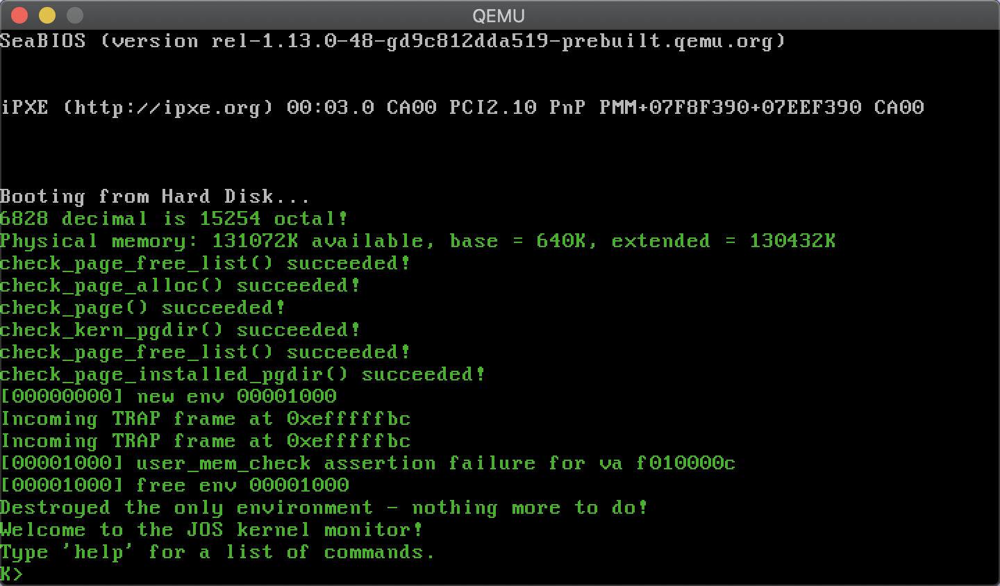
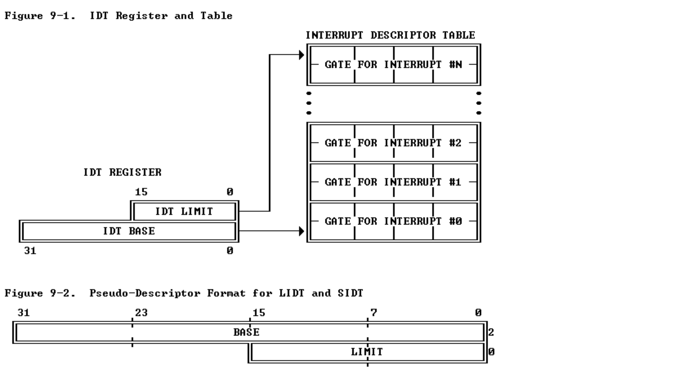

# LAB 3

*by Woooooow~ / start 2020/10/20 / end 2020/10/25*

## Solution to the Exercise

### Exercise 1

> **Exercise 1.** Modify `mem_init()` in kern/pmap.c to allocate and map the envs array. This array consists of exactly NENV instances of the Env structure allocated much like how you allocated the pages array. Also like the pages array, the memory backing envs should also be mapped user read-only at UENVS (defined in inc/memlayout.h) so user processes can read from this array.
>
> You should run your code and make sure `check_kern_pgdir()` succeeds.

这里让我们学 lab2 初始化 `kern_pgdir` 一样初始化 `envs`, 也就是给 `envs` 用 `boot_alloc` 分配空间, 然后置零

```cpp
    //////////////////////////////////////////////////////////////////////
    // Make 'envs' point to an array of size 'NENV' of 'struct Env'.
    // LAB 3: Your code here.
    envs = (struct Env *) boot_alloc(sizeof(struct Env) * NENV);
    memset(envs, 0, PGSIZE);
```

然后继续照着要求将得到的这块地址映射到虚拟地址 `UENVS` 上 ( 各种意义上的上, 嗯 ), 由于这里和 lab2 么得太大区别, 就不做过多介绍了

```cpp
    //////////////////////////////////////////////////////////////////////
    // Map the 'envs' array read-only by the user at linear address UENVS
    // (ie. perm = PTE_U | PTE_P).
    // Permissions:
    //    - the new image at UENVS  -- kernel R, user R
    //    - envs itself -- kernel RW, user NONE
    // LAB 3: Your code here.
    boot_map_region(kern_pgdir, UENVS, ROUNDUP((NENV * sizeof(struct Env)), PGSIZE),\
    PADDR(envs), PTE_U | PTE_P);
```

### Exercise 2

> Exercise 2. In the file env.c, finish coding the following functions:
>
> `env_init()`  
> Initialize all of the Env structures in the envs array and add them to the env_free_list. Also calls env_init_percpu, which configures the segmentation hardware with separate segments for privilege level 0 (kernel) and privilege level 3 (user).
>
> `env_setup_vm()`  
> Allocate a page directory for a new environment and initialize the kernel portion of the new environment's address space.
>
> `region_alloc()`  
> Allocates and maps physical memory for an environment
>
> `load_icode()`  
> You will need to parse an ELF binary image, much like the boot loader already does, and load its contents into the user address space of a new environment.
>
> `env_create()`  
> Allocate an environment with env_alloc and call load_icode to load an ELF binary into it.
>
> `env_run()`  
> Start a given environment running in user mode.
>
> As you write these functions, you might find the new cprintf verb %e useful -- it prints a description corresponding to an error code. For example,
>
> `r = -E_NO_MEM;`
> `panic("env_alloc: %e", r);`
> will panic with the message "env_alloc: out of memory".

#### **env_init()**

把上一问中初始化得到的 `envs` 的 status 全置为 *ENV_FREE*, 同时将他们的 `env_id` 置零, 并按照递增顺序加入 `env_free_list` 中 ( `env_free_list` 指向的应该是 `envs[0]` ). 总体来说就是对着要求写一下就出来了. 具体实现如下:

```cpp
void
env_init(void)
{
    // Set up envs array
    // LAB 3: Your code here.
    for (int i = NENV-1; i >= 0; --i){
        envs[i].env_link = env_free_list;
        envs[i].env_id = 0;
        envs[i].env_status = ENV_FREE;
        env_free_list = &envs[i];
    }

    // Per-CPU part of the initialization
    env_init_percpu();
}
```

#### **env_setup_vm()**

初始化 procee 的 page table directory, 这个函数先调用 `page_alloc()` 申请到了一个空的 page ( 而且是已经置 0 的 ), 然后将这个申请到的 page 传给当前 env 的 `env_pgdir` 作为当前 process 的 PTD, 然后再将之前设置好的 kernel 内的 PTD 拷贝过来 ( 每个进程都有对应的 kernel 映射, 方便 system call ). 这里又由于 lab2 中, 在初始化 kernel 的 virtual memory 的时候我们没有将 UTOP 一下的内容映射到 `kern_pgdir` 这个 kernel PTD 中, 所以我们这里就快乐的将整个 `kern_pgdir` 数组的内容复制到我们进程 PTD 数组上就 ok 了.

在函数的最后 `e->env_pgdir[PDX(UVPT)] = PADDR(e->env_pgdir) | PTE_P | PTE_U;` 这个操作将这个进程的 PTD 映射到 UVPT 上, 也就是说, 未来进程只要查找 va 上的 UVPT 就可以找到自己的 PTD ( 就是直接通过查找 UVPT 就可以看到自己的内存信息了 ). 具体实现如下:

```cpp
static int
env_setup_vm(struct Env *e)
{
    int i;
    struct PageInfo *p = NULL;

    // Allocate a page for the page directory
    if (!(p = page_alloc(ALLOC_ZERO)))
        return -E_NO_MEM;

    // Now, set e->env_pgdir and initialize the page directory.
    //
    // Hint:
    //    - The VA space of all envs is identical above UTOP
    //  (except at UVPT, which we've set below).
    //  See inc/memlayout.h for permissions and layout.
    //  Can you use kern_pgdir as a template?  Hint: Yes.
    //  (Make sure you got the permissions right in Lab 2.)
    //    - The initial VA below UTOP is empty.
    //    - You do not need to make any more calls to page_alloc.
    //    - Note: In general, pp_ref is not maintained for
    //  physical pages mapped only above UTOP, but env_pgdir
    //  is an exception -- you need to increment env_pgdir's
    //  pp_ref for env_free to work correctly.
    //    - The functions in kern/pmap.h are handy.

    // LAB 3: Your code here.
    ++p->pp_ref;
    e->env_pgdir = (pde_t *) page2kva(p);
    for (int i = 0; i < NPDENTRIES; ++i)
        *(e->env_pgdir + i) = kern_pgdir[i];

    // UVPT maps the env's own page table read-only.
    // Permissions: kernel R, user R
    e->env_pgdir[PDX(UVPT)] = PADDR(e->env_pgdir) | PTE_P | PTE_U;

    return 0;
}
```

#### **region_alloc()**

分配大小为 `ROUNUP(va+len) - ROUNDDOWN(va)` 的空间给进程 `e`, 并映射到虚拟地址 `ROUNDDOWN(va)` 处.
这里主要用一下 lab2 中写过的 `page_alloc(0)` 函数分配 page ( 题目要求得到的 page 不应该任何初始化, 包括置零 ), 然后利用 `page_insert()` 将所得到的 page 插入进程. 具体实现如下:

```cpp
static void
region_alloc(struct Env *e, void *va, size_t len)
{
    // LAB 3: Your code here.
    // (But only if you need it for load_icode.)
    //
    // Hint: It is easier to use region_alloc if the caller can pass
    //   'va' and 'len' values that are not page-aligned.
    //   You should round va down, and round (va + len) up.
    //   (Watch out for corner-cases!)
    void *begin = ROUNDDOWN(va, PGSIZE);
    void *end = ROUNDUP(va+len, PGSIZE);
    struct PageInfo *pginfo;

    for (; begin < end; begin += PGSIZE){
        if(!(pginfo = page_alloc(0)))
            panic("region_alloc panic, allocation attempt fails.\n");
        page_insert(e->env_pgdir, pginfo, begin, PTE_W | PTE_U | PTE_P);
    }
}
```

#### **load_icode()**

把程序加载到内存上 ( 希望没有理解出错 ), 传入的 `binary` 其实是指向 `ELFHD` 的指针 ( 受到 boot/main.c 启发 ) 然后学习 boot/main.c 中写法 ( 其实就是代码复制粘贴 ), 先判断 `ELFHD` 的 MAGIC 是否正确, 然后再定位 program header 数组的起始位置 `ph = (struct Proghdr *)((uint8_t *) ELFHDR + ELFHDR->e_phoff)` 和结束位置 `eph = ph + ELFHDR->e_phnum;`; 再通过 `lcr3(PADDR(e->env_pgdir))` ( load %cr3 ) 这个函数, 将进程对应的 PTD 加载到 cr3 寄存器上 ( 专门用来标识进程对应的 PTD 的寄存器 ). 之后进入循环, 加载 segments. 进入循环后先根据要求判断 `ph->p_type == ELF_PROG_LOAD` 然后调用 `region_alloc()` 分配空间, 之后先用 `memset()` 将分配的空间全部置零 ( 之后就不用思考怎么将 bss 段置零, 因为他一开始就是 *0*, hhh ), 最后用更具题目将 `binary + ph->p_offset` 起始, 长度为 `ph->p_filesz` 的空间, 拷贝到以 `ph->p_va` 为起始的空间上 ( 也就是刚才分配的空间, 多出来部分由于之前操作已经被置零, 就不用管了 )

后面又把 cr3 置为 `kern_pgdir` 这里没有理解清楚, 当时 debug 不出来就直接上网找答案了嗷. 后面就是将进程对应的 eip 设置为 ELFHD 的 `entry` (这里是参考 boot/main.c), 最后这个要写的部分就按照要求调用 `region_alloc()` 函数就可以了. 具体实现如下:

```cpp
static void
load_icode(struct Env *e, uint8_t *binary)
{
    // Hints:
    //  Load each program segment into virtual memory
    //  at the address specified in the ELF segment header.
    //  You should only load segments with ph->p_type == ELF_PROG_LOAD.
    //  Each segment's virtual address can be found in ph->p_va
    //  and its size in memory can be found in ph->p_memsz.
    //  The ph->p_filesz bytes from the ELF binary, starting at
    //  'binary + ph->p_offset', should be copied to virtual address
    //  ph->p_va.  Any remaining memory bytes should be cleared to zero.
    //  (The ELF header should have ph->p_filesz <= ph->p_memsz.)
    //  Use functions from the previous lab to allocate and map pages.
    //
    //  All page protection bits should be user read/write for now.
    //  ELF segments are not necessarily page-aligned, but you can
    //  assume for this function that no two segments will touch
    //  the same virtual page.
    //
    //  You may find a function like region_alloc useful.
    //
    //  Loading the segments is much simpler if you can move data
    //  directly into the virtual addresses stored in the ELF binary.
    //  So which page directory should be in force during
    //  this function?
    //
    //  You must also do something with the program's entry point,
    //  to make sure that the environment starts executing there.
    //  What?  (See env_run() and env_pop_tf() below.)

    // LAB 3: Your code here.
    struct Elf *ELFHDR = (struct Elf *)binary;
    struct Proghdr *ph, *eph;
    if (ELFHDR->e_magic != ELF_MAGIC)
    panic("load_icode panic, ELFHDR magic error.\n");

    ph = (struct Proghdr *) ((uint8_t *) ELFHDR + ELFHDR->e_phoff);
    eph = ph + ELFHDR->e_phnum;
    lcr3(PADDR(e->env_pgdir));
    for (; ph < eph; ph++) {
        if(!ph->p_type == ELF_PROG_LOAD)
            continue;
        region_alloc(e, (void *)ph->p_va, ph->p_memsz);
        memset((void *)ph->p_va, 0, ph->p_memsz);
        memcpy((void *)ph->p_va, (void *)(binary + ph->p_offset), ph->p_filesz);
    }
    lcr3(PADDR(kern_pgdir));
    e->env_tf.tf_eip = ELFHDR->e_entry;

    // Now map one page for the program's initial stack
    // at virtual address USTACKTOP - PGSIZE.

    // LAB 3: Your code here.
    region_alloc(e, (void *)(USTACKTOP - PGSIZE), PGSIZE);
}
```

#### **env_create()**

这个函数就是申请一个进程, 然后将程序写到里面, 根据要求写就好了. 具体实现如下:

```cpp
void
env_create(uint8_t *binary, enum EnvType type)
{
    // LAB 3: Your code here.
    struct Env *env = NULL;
    assert(!env_alloc(&env, 0));
    env->env_type = type;
    load_icode(env, binary);
}
```

#### **env_run()**

这个函数也就是对着要求写一下就好了... 就是一个简易版的 context switch 方程, 最要的应该是最后两步, 转换 PDT `lcr3(PADDR(curenv->env_pgdir));` 和替换寄存器 `env_pop_tf(&(curenv->env_tf));`. 具体实现如下:

```cpp
void
env_run(struct Env *e)
{
    // Step 1: If this is a context switch (a new environment is running):
    //     1. Set the current environment (if any) back to
    //        ENV_RUNNABLE if it is ENV_RUNNING (think about
    //        what other states it can be in),
    if (curenv && curenv->env_status == ENV_RUNNING) {
        curenv->env_status = ENV_RUNNABLE;
    }
    //     2. Set 'curenv' to the new environment,
    curenv = e;
    //     3. Set its status to ENV_RUNNING,
    curenv->env_status = ENV_RUNNING;
    //     4. Update its 'env_runs' counter,
    ++curenv->env_runs;
    //     5. Use lcr3() to switch to its address space.
    lcr3(PADDR(curenv->env_pgdir));

    // Step 2: Use env_pop_tf() to restore the environment's
    //     registers and drop into user mode in the
    //     environment.
    env_pop_tf(&(curenv->env_tf));

    // Hint: This function loads the new environment's state from
    //  e->env_tf.  Go back through the code you wrote above
    //  and make sure you have set the relevant parts of
    //  e->env_tf to sensible values.

    panic("env_run not yet implemented");
}
```

#### Result 2

> 
> **Figure 1** -- exercise 2 result

### Exercise 4

> **Exercise 4.** Edit trapentry.S and trap.c and implement the features described above. The macros `TRAPHANDLER` and `TRAPHANDLER_NOEC` in trapentry.S should help you, as well as the `T_*` defines in inc/trap.h. You will need to add an entry point in trapentry.S (using those macros) for each trap defined in inc/trap.h, and you'll have to provide _alltraps which the `TRAPHANDLER` macros refer to. You will also need to modify `trap_init()` to initialize the idt to point to each of these entry points defined in trapentry.S; the SETGATE macro will be helpful here.
>
> Your _alltraps should:
>
> 1. push values to make the stack look like a struct `Trapframe`
> 2. load `GD_KD` into `%ds` and `%es`
> 3. `pushl %esp` to pass a pointer to the `Trapframe` as an argument to `trap()`
> 4. `call trap` (can trap ever return?)
>
> Consider using the pushal instruction; it fits nicely with the layout of the struct Trapframe.
>
> Test your trap handling code using some of the test programs in the user directory that cause exceptions before making any system calls, such as user/divzero. You should be able to get **`make grade`** to succeed on the divzero, softint, and badsegment tests at this point.

<!-- 这个真就把我做傻了, 怎么会这么神奇 ( ~~NT~~ ), 这里做的事情和 Interrupt 过程 ( 或者说和 Interrupt 实现细节没太大关系, 你甚至不需要知道 IDT 里面存的东西的细节, 你唯一需要知道的就是程序是怎么组织这些代码, 或者说怎么连接这些代码, 这里真就把我给看蒙了, 然而大概这一切都源于是我英语不好吧 ) -->

<!-- 这个练习要我们做的就是将 IDT 这个数组里 0-19 的内容填进去 ( 这些东西在 [inc/trap.h](inc/trap.h) 中 ), 而 IDT 这个数组里的内容则是一个进入 Interrupt Handler 的 Gate ( 反正 manual 里都叫 Gate 了, 这个叫法也很形象, 类似于 page table **ENTRY** 这种用法, 但是格式上和 GDT 基本一样 ( 所以 GDT 里面保存的也是一种 **ENTRY** ) ).

然而, 比较头疼的是我们要填进去的内容, 全都没法现成得到, 所以我们需要分别在 [kern/trapentry.S](kern/trapentry.S) 和 [kernel/trap.c:trap_init()](kern/trap.c) 中做点事情, 得到这些东西 () -->

kernel/trapentry.S 中利用给定的两个宏和 **Table 3-1** 中给定的是否要加 error code 的信息设置 0-31 handler ( 其实只有 **Table 3-1** 0-19 那么几个需要设置 ). 之后转到 kernel/trap.c:trap_init() 声明 handler 函数 ( 这些函数来自 kernel/trapentry.S, 这里不过是声明获得 handler 的地址罢了 ~~主人的任务罢了~~ ), 并用函数地址初始化 IDT GATE ( 这里完成了中断函数, 尤其是 0-31 上发生在函指令执行期间的中断函数的初始化 ). 然后再回到 kernel/trapentry.S 中将宏跳转到的函数 `_alltraps:` 补充完整就结束了.

> Each exception or interrupt should have its own handler in trapentry.S and `trap_init()` should initialize the IDT with the addresses of these handlers. Each of the handlers should build a struct Trapframe (see inc/trap.h) on the stack and call `trap()` (in trap.c) with a pointer to the Trapframe. `trap()` then handles the exception/interrupt or dispatches to a specific handler function.

*整了这么多没用的 manual, 还是 lab 里 exercise4 上面的这段话最有用了 ( 虽然我还是没搞清楚 trapentry.S 里面的东西到底是用来初始化 handler 的还是用来entry interrupt 的, 这里面明明做了压栈或者说 context switch, 理应是个进入handler 的某个过程 ( 原谅我小学生般的表述能力 ), 但是为啥这里说 `trap_init()` should initialize the IDT with the addresses of these handlers 换句话, handler 的地址到底在哪定义的, 我们是在什么时候将这些handler 初始化并放入 kernel 的 )*

> Description                       | Interrupt     | Error Code
> ----------------------------------|---------------|-----------
> Divide error                      | 0             | No
> Debug exceptions                  | 1             | No
> Breakpoint                        | 3             | No
> Overflow                          | 4             | No
> Bounds check                      | 5             | No
> Invalid opcode                    | 6             | No
> Coprocessor not available         | 7             | No
> System error                      | 8             | Yes (always 0)
> Coprocessor Segment Overrun       | 9             | No
> Invalid TSS                       | 10            | Yes
> Segment not present               | 11            | Yes
> Stack exception                   | 12            | Yes
> General protection fault          | 13            | Yes
> Page fault                        | 14            | Yes
> x87 FPU Floating-Point Error      | 16            | No
> Alignment Check Exception         | 17            | Yes
> Machine-Check Exception           | 18            | No
> SIMD Floating-Point Exception     | 19            | No
> Two-byte SW interrupt             | 0-255         | No
> **Table 3-1**. [Error-Code Summary](https://pdos.csail.mit.edu/6.828/2018/readings/i386/s09_10.htm)

如果不去考虑过多过程, 这道题目其实也就是按照代码中所给的注释一步步做就能做出来了. 第一件事就是对照 inc/trap.h 中的宏和上表所给的对应关系, 利用 kernel/entrytrap.S 中两个宏 `TRAPHANDLER(name, num)`( 对应包含 Error Code 的Interrupt ) 和 `TRAPHANDLER_NOEC(name, num)` ( 对应不包含 Error Code 的Interrupt ), 初始化 ( ?表示不清楚 ) intterupt 并且给每个取个名, 好在 kernel/trap.c 中引用获取地址. 具体实现如下

```x86asm
/*
 * Lab 3: Your code here for generating entry points for the different traps.
 */
TRAPHANDLER_NOEC(DivideHandler, T_DIVIDE)
TRAPHANDLER_NOEC(DebugHandler, T_DEBUG)
TRAPHANDLER_NOEC(NmiHandler, T_NMI)
TRAPHANDLER_NOEC(BrkptHandler, T_BRKPT)
TRAPHANDLER_NOEC(OflowHandler, T_OFLOW)
TRAPHANDLER_NOEC(BoundHandler, T_BOUND)
TRAPHANDLER_NOEC(IllopHandler, T_ILLOP)
TRAPHANDLER_NOEC(DeviceHandler, T_DEVICE)
TRAPHANDLER(DblfltHandler, T_DBLFLT)
/* #define T_COPROC  9  reserved (not generated by recent processors) */
TRAPHANDLER(TssHandler, T_TSS)
TRAPHANDLER(SegnpHandler, T_SEGNP)
TRAPHANDLER(StackHandler, T_STACK)
TRAPHANDLER(GpfltHandler, T_GPFLT)
TRAPHANDLER(PgfltHandler, T_PGFLT)
/* #define T_RES    15   reserved */
TRAPHANDLER_NOEC(FperrHandler, T_FPERR)
TRAPHANDLER(AlignHandler, T_ALIGN)
TRAPHANDLER_NOEC(MchkHandler, T_MCHK)
TRAPHANDLER_NOEC(SimderrHandler, T_SIMDERR)
```

注意到, `TRAPHANDLER(name, num)` 和 `TRAPHANDLER_NOEC(name, num)` push 完 num 后都会跳转到 `_alltraps:` 函数继续完成 [`Trapfram`](inc/trap.h) 的压栈 ( 也就是说我们要完成 `tf_trapno` 以上的内容的压栈. 注意在 `Trapfram` 中 `tf_err` 到 `tf_eflags` 是硬件自行压栈的, 而之后三项是当 Interrupt 发生在 user model 下转入 kernel model 时才需要压栈的, 也就是恢复 user stack 用的. 而为了实现 `Trapfram` 的结构, 应当以变量定义的相反方向压入变量 ). 这里我们要利用

```x86asm
pushw $0
pushw %ds
pushw $0
pushw %es
```

把 %ds 和 %es 分别依次压入栈中. 然后根据要求利用通用寄存器 ax 将变量 *GD_KD* 复制给 ds 和 es, 最后 `pushl %esp` 传递指向 `Trapfram` 的指针给接下来要 call 的函数 `trap()`. 最后 `call trap`. 具体实现如下:

```x86asm
_alltraps:
    pushw $0
    pushw %ds
    pushw $0
    pushw %es
    pushal
    movw $GD_KD, %ax
    movw %ax, %ds
    movw %ax, %es
    pushl %esp
    call trap
```

题目最后返回到 kernel/trap.c 中在函数 `trap_init()` 中申明刚才在 kernel/entrytrap.S 中定义的 handler 并且将他们装入 idt 中完成 idt 的初始化. 具体实现如下:

```cpp
void
trap_init(void)
{
    extern struct Segdesc gdt[];

    // LAB 3: Your code here.
    //
    void DivideHandler();
    void DebugHandler();
    void NmiHandler();
    void BrkptHandler();
    void OflowHandler();
    void BoundHandler();
    void IllopHandler();
    void DeviceHandler();
    void DblfltHandler();
    /* #define T_COPROC  9 */   // reserved (not generated by recent processors)
    void TssHandler();
    void SegnpHandler();
    void StackHandler();
    void GpfltHandler();
    void PgfltHandler();
    /* #define T_RES    15 */   // reserved
    void FperrHandler();
    void AlignHandler();
    void MchkHandler();
    void SimderrHandler();

    SETGATE(idt[T_DIVIDE], 0, GD_KT, DivideHandler, 0);
    SETGATE(idt[T_DEBUG], 0, GD_KT, DebugHandler, 0);
    SETGATE(idt[T_NMI], 0, GD_KT, NmiHandler, 0);
    SETGATE(idt[T_BRKPT], 0, GD_KT, BrkptHandler, 0);
    SETGATE(idt[T_OFLOW], 0, GD_KT, OflowHandler, 0);
    SETGATE(idt[T_BOUND], 0, GD_KT, BoundHandler, 0);
    SETGATE(idt[T_ILLOP], 0, GD_KT, IllopHandler, 0);
    SETGATE(idt[T_DEVICE], 0, GD_KT, DeviceHandler, 0);
    SETGATE(idt[T_DBLFLT], 0, GD_KT, DblfltHandler, 0);
    /* #define T_COPROC  9 */   // reserved (not generated by   recent processors)
    SETGATE(idt[T_TSS], 0, GD_KT, TssHandler, 0);
    SETGATE(idt[T_SEGNP], 0, GD_KT, SegnpHandler, 0);
    SETGATE(idt[T_STACK], 0, GD_KT, StackHandler, 0);
    SETGATE(idt[T_GPFLT], 0, GD_KT, GpfltHandler, 0);
    SETGATE(idt[T_PGFLT], 0, GD_KT, PgfltHandler, 0);
    /* #define T_RES    15 */   // reserved
    SETGATE(idt[T_FPERR], 0, GD_KT, FperrHandler, 0);
    SETGATE(idt[T_ALIGN], 0, GD_KT, AlignHandler, 0);
    SETGATE(idt[T_MCHK], 0, GD_KT, MchkHandler, 0);
    SETGATE(idt[T_SIMDERR], 0, GD_KT, SimderrHandler, 0);

    // Per-CPU setup
    trap_init_percpu();
}
```

#### Result 4

> 
> **Figure 3-2** -- exercise 4 result

### *Challenge 1!*

可能以后回来做吧, 这个得研究下 xv6 那个写法. 叹气

### Questions1

> - What is the purpose of having an individual handler function for each exception/interrupt? (i.e., if all exceptions/interrupts were delivered to the same handler, what feature that exists in the current implementation could not be provided?)

就没办法提供保护措施? 主要是这样还很难实现, 并且不符合现代的 design pattern 嗷

### Question2

> - Did you have to do anything to make the user/softint program behave correctly? The grade script expects it to produce a general protection fault (trap 13), but softint's code says int $14. Why should this produce interrupt vector 13? What happens if the kernel actually allows softint's int $14 instruction to invoke the kernel's page fault handler (which is interrupt vector 14)?

- 不需要干什么, 只需要让 user 的 program 安静的在 user model 下运行即可.
- user model 下的代码没法影响 kernel model 的 interrupt handler. 如果想要调用比当前级别高的代码就会触发 General Protection Exception. 所以这里理所当然的跳转到了 trap 13.
- 这样 user 可以调用内存资源了, 这要 os 干啥.

### Exercise 5

> **Exercise 5.** Modify `trap_dispatch()` to dispatch page fault exceptions to `page_fault_handler()`. You should now be able to get make grade to succeed on the `faultread`, `faultreadkernel`, `faultwrite`, and `faultwritekernel` tests. If any of them don't work, figure out why and fix them. Remember that you can boot JOS into a particular user program using **`make run-x`** or **`make run-x-nox`**. For instance, **`make run-hello-nox`** runs the *hello* user program.

这里就真没啥好解释的, 就直接按照要求调用 `page_fault_handler(tf)` 就结束了, 具体实现如下:

```cpp
static void
trap_dispatch(struct Trapframe *tf)
{
    // Handle processor exceptions.
    // LAB 3: Your code here.
    switch(tf->tf_trapno){
        case T_PGFLT:
            page_fault_handler(tf);
            return;
        default: ;
    }

    // Unexpected trap: The user process or the kernel has a bug.
    print_trapframe(tf);
    if (tf->tf_cs == GD_KT)
        panic("unhandled trap in kernel");
    else {
        env_destroy(curenv);
        return;
    }
}
```

PS: 这里用 switch 就是为了之后写起来比较方便 ( 毕竟是个 dispatch 函数嘛有多个选择就直接用 switch 嗷 )

#### Result 5

> 
> **Figure 3-2** -- exercise 5 result

### Exercise 6

> **Exercise 6.** Modify `trap_dispatch()` to make breakpoint exceptions invoke the kernel monitor. You should now be able to get make grade to succeed on the breakpoint test.

这里要注意把 `trap_init()` 里面对应的 idt gate 的 `DPL` 改成 *3* ( 也就是用户态, 别问问就是题目要求 ) 具体实现如下:

```cpp
// in trap_dispatch()
case T_BRKPT:
    monitor(tf);
    return;
```

```cpp
// in trap_init()
SETGATE(idt[T_BRKPT], 0, GD_KT, BrkptHandler, 3);
```

#### Result 6

> 
> **Figure 3-4** -- exercise 6 result

### Exercise 7

> **Exercise 7.** Add a handler in the kernel for interrupt vector `T_SYSCALL`. You will have to edit kern/trapentry.S and kern/trap.c's `trap_init()`. You also need to change `trap_dispatch()` to handle the system call interrupt by calling `syscall()` (defined in kern/syscall.c) with the appropriate arguments, and then arranging for the return value to be passed back to the user process in %eax. Finally, you need to implement `syscall()` in kern/syscall.c. Make sure `syscall()` returns `-E_INVAL`if the system call number is invalid. You should read and understand lib/syscall.c (especially the inline assembly routine) in order to confirm your understanding of the system call interface. Handle all the system calls listed in inc/syscall.h by invoking the corresponding kernel function for each call.
>
> Run the user/hello program under your kernel (**`make run-hello`**). It should print "*hello, world*" on the console and then cause a page fault in user mode. If this does not happen, it probably means your system call handler isn't quite right. You should also now be able to get **`make grade`** to succeed on the `testbss` test.

这个 exercise 前面写得听清楚了, 先在 kern/trapentry.S 中加入 `TRAPHANDLER_NOEC(SystemcallHandler, T_SYSCALL)`, 而后在 kern/trap.c 的 `trap_init()` 中加入如下代码:

```cpp
void SystemcallHandler();
SETGATE(idt[T_SYSCALL], 0, GD_KT, SystemcallHandler, 3);
```

这样你就将 System Call 加入 Interrupt ~~豪华午餐~~ ( 这里要注意, 由于我们要在 user model 下调用 system call 所以要设置他的 PDL 为 *3* ). 之后根据提示, 我们将在 `trap_dispatch()` 函数的 switch 中加上 systemcall. 由提示, `syscall()` 函数的变量分别为 user 转到 kernel 时寄存器中存放的 `%eax`->num, `%edx`, `%ecx`, `%ebx`, `%edi`, `%esi`-> `a1`~`a5`, 最后将返回值递交给 `%eax` ( 做完这道题突然发现前面的东西全理解了, 我前面思考的好几天真的好没有意义啊啊啊啊啊啊~ 等下在 ps 中描述我理解的 interrupt, 虽然也不一定对 ) 具体实现如下:

```cpp
case T_SYSCALL:
    tf->tf_regs.reg_eax = syscall(tf->tf_regs.reg_eax,
    tf->tf_regs.reg_edx, tf->tf_regs.reg_ecx,
    tf->tf_regs.reg_ebx, tf->tf_regs.reg_edi,
    tf->tf_regs.reg_esi);
    return;
```

最后在 kernel/syscall.c 中修改 `syscall()` 函数, 这里真没啥好提的就是把这个函数上面的函数全都放到 switch 中就好了, 对应 case syscallno 就是定义在 inc/syscall.h 中的那个枚举. 具体实现如下:

```cpp
int32_t
syscall(uint32_t syscallno, uint32_t a1, uint32_t a2, uint32_t a3, uint32_t a4, uint32_t a5)
{
    // Call the function corresponding to the 'syscallno' parameter.
    // Return any appropriate return value.
    // LAB 3: Your code here.

    // panic("syscall not implemented");

    switch (syscallno) {
        case SYS_cputs:
            sys_cputs((char *)a1, (size_t)a2);
            return 0;
        case SYS_cgetc:
            return sys_cgetc();
        case SYS_getenvid:
            return sys_getenvid();
        case SYS_env_destroy:
            return sys_env_destroy((envid_t)a1);
        case NSYSCALLS:
        default:
            return -E_INVAL;
    }
}
```

PS: 这里 Interrupt 应当是现在 kernel/trap.c:`trap_init()` 中将申明的函数入口放入 IDT 中, 在需要 interrupt 的时候 kernel/entrytrap.S 在 kernel model 中给这个函数分配了空间, 然后用 `Trapfram` 这个数据结构保存调用者信息并且将调用者压入 kernel stack 中, 然后调用 `trap()` 函, 并将`Trapfram` 这个数据结构的指针作为参数出给函数, 从而正式进入 interrupt 处理阶段. 在 `trap()` 函数中, 先设置小段法 ( `cld` 别问, 问就是不知道 ), 然后查看是否阻塞了 interrupt, 再检查此时 context 是不是不在 user model. 最后就是调用 `trap_dispatch()` 调用对应的 handler. 好像豁然开朗嗷.

#### Result 7

> 
> **Figure 3-5** -- exercise 7 result 1
>
> 
> **Figure 3-6** -- exercise 7 result 2

### Exercise 8

> **Exercise 8.** Add the required code to the user library, then boot your kernel. You should see user/hello print "*hello, world*" and then print "*i am environment 00001000*". user/hello then attempts to "*exit*" by calling `sys_env_destroy()` (see lib/libmain.c and lib/exit.c). Since the kernel currently only supports one user environment, it should report that it has destroyed the only environment and then drop into the kernel monitor. You should be able to get make grade to succeed on the hello test.

这个也挺简单的, `thisenv` 指向的是当前进程, 所以通过 `sys_getenvid()` 得到当前进程的 id 后经过 ENVX 得到其在 Env[] 数组中的下标, 从而得到地址. 具体实现如下:

```cpp
void
libmain(int argc, char **argv)
{
    // set thisenv to point at our Env structure in envs[].
    // LAB 3: Your code here.
    thisenv = &envs[ENVX(sys_getenvid())];


    // save the name of the program so that panic() can use it
    if (argc > 0)
        binaryname = argv[0];

    // call user main routine
    umain(argc, argv);

    // exit gracefully
    exit();
}
```

#### Result 8

> 
> **Figure 3-7** -- exercise 8

### Exercise 9 & 10

由于这个搞了太多时间, 这两天就不太想写思路, 之后回顾的时候再把这里补上吧, 害得补别的课程的进度了...

#### Result 9 & 10

> 
> **Figure 3-8** -- final
>
> `make run-buggyhello`
> 
> **Figure 3-9** -- Exercise 9
>
> `make run-evilhello`
> 
> **Figure 3-10** -- Exercise 10

## Solution to the TA's Question

~~不过助教的任务罢了~~

### TA's Exercise

> 在 JOS 中添加一个展示进程信息的系统调用 ( 请在 inc/syscall.h 中定义`SYS_show_environments` ), 该系统调用可打印出所有进程的信息 ( 即 `struct Env` 的 内容，只打印 `env_id`, 寄存器信息等重要内容即可 ), 参数可以自由定义.

#### 整体流程

在 inc/syscall.h 中的枚举中定义变量 `SYS_show_environments`, 后在 kern/syscall.c 中定义函数 `static void sys_show_environments(void)` 打印 envs 数组中正在进行的进程的 env_id 以及状态 ( 不包括 `env_status == ENV_NOT_RUNNABLE` ), 并且在文件末尾 `syscall` 函数中加入新加 system call. 到此为止, 我们设置完了在 kernel model 下新系统调用的调用过程, 之后转向 user model. 在 inc/lib 中声明刚定义的系统调用, 并转到 lib/syscall.c 下的 syscall.c 中, 利用 syscall 调用之前定义在 kernel 中的 `sys_show_environments(void)`, 最后在 user/hello.c 中加入了这个调用就可以看到结果了.

#### 调用过程及代码实现

user/hello.c 调用在 inc/lib.h 中声明的 `sys_show_environments()`, 也就是在 lib/syscall.c 中定义的 ( 面对 user model 的 ) `sys_show_environments()`.

```cpp
// at inc/lib.h:42
void sys_show_environments(void);
```

在 lib/syscall.c 中函数调用 `syscall()` 并且传参 `SYS_show_environments` 给 `syscall()`. 之后 `syscall()` 利用内联汇编 trap into the kernel 并将 `T_SYSCALL`, `SYS_show_environments` 这两个参数传给给后续函数 ( 后面虽然还传递了好几个 *0* 但是这里没有用就当他们不存在, 而这里 `T_SYSCALL` ( 作为立即数传入 "i" ) 是用来做为索引给 IDT 找到 SystemCall 这个 Interrupt 的 Gate ( 当然这也是之后 `trap_dispatch()` 要用到的参数 ), 而之后的 `SYS_show_environments` 会被放入 `%eax` 中, 之后将通过 `Trapfram` 进入 kernel model 下的 stack 被 kernel 中的 system call 识别并调用对应的系统调用. )

```cpp
// at lib/syscall.c:64
void
sys_show_environments(void)
{
    syscall(SYS_show_environments, 0, 0, 0, 0, 0, 0);
}
```

`trap_dispatch()` 中选择 `syscall()` 函数, 并将 Trapfram 中的"寄存器" ( 其实是在 kernel stack 中 ) 保存的数据作为参数传入, 之后在 kern/syscall.c 中 `syscall()` 选择 `sys_show_environments()` 函数打印进程相关信息.

```cpp
static void
sys_show_environments(void) {
    for(int i = 0; i < NENV; ++i){
        if (envs[i].env_status == ENV_FREE || \
        envs[i].env_status == ENV_NOT_RUNNABLE)
            continue;
        cprintf("Environment env_id: %x\tstatus: ", envs[i].env_id);
        switch(envs[i].env_status){
            case ENV_DYING:
                cprintf("ENV_DYING\n");
                break;
            case ENV_RUNNABLE:
                cprintf("ENV_RUNNABLE\n");
                break;
            case ENV_RUNNING:
                cprintf("ENV_RUNNING\n");
                break;
            default: ;
        }
    }
    return;
}

// Dispatches to the correct kernel function, passing the arguments.
int32_t
syscall(uint32_t syscallno, uint32_t a1, uint32_t a2, uint32_t a3, uint32_t a4, uint32_t a5)
{
    // Call the function corresponding to the 'syscallno' parameter.
    // Return any appropriate return value.
    // LAB 3: Your code here.


    switch (syscallno) {
        case SYS_cputs:
            sys_cputs((char *)a1, (size_t)a2);
            return 0;
        case SYS_cgetc:
            return sys_cgetc();
        case SYS_getenvid:
            return sys_getenvid();
        case SYS_env_destroy:
            return sys_env_destroy((envid_t)a1);
        case SYS_show_environments:
            sys_show_environments();
            return 0;
        case NSYSCALLS:
        default:
            return -E_INVAL;
    }
    panic("syscall not implemented");
}
```

The End

#### Result TA's Exercise

> **`make run-hello`**
> 
> **Figure 3-11**

### TA's Question 1

> **Question 1:** JOS 中, 内核态页表基地址定义在哪个变量中? 页表基地址存在哪个寄存器中? JOS 中如何切换页表基地址空间?

- 内核态页表基地址定义在变量 [`kern_pgdir`](kern/pmap.c) 中 ( 在 kern/pmap.c 定义和赋值, 如图, 具体细节请看 [Lab2.md](Lab2.md) )

> 
> **Figure 3-12**
> 
> **Figure 3-13**

- 页表基地址存在 `cr3` 中
- 改变 cr3 寄存器中的内容就好了... `lcr3()`

### TA's Question 2

> **Question 2:** iret 指令的功能和作用是什么? Kernel Stack 的栈顶在在哪里定义? Exception 陷入 kernel 的时候, esp, eip, eax, ebx 分别是谁(processer，jos kernel)保存的?

- iret 用来退出 intrrupt 进程 ( kernel 下的那个 ), 然后将控制返回给引起 intrrupt 的程序 ( 差不多是一个 switch context 虽然有点不太一样 ), 同时这个指令也可以从 nested task 中返回 ( kernel model 下 kernel 自己调用的 interrupt 的返回 ). 具体细节就调用后把 trapfram ( 放在 kerenl stack 中 ) 里面保存的调用者寄存器恢复, 如果调用这是 user model 还要恢复他的 stack 不是就不用了.

> The IRET instruction is used to exit from an interrupt procedure.
> Returns program control from an exception or interrupt handler to a program or procedure that was interrupted by an exception, an external interrupt, or a software-generated interrupt. These instructions are also used to perform a return from a nested task. (A nested task is created when a CALL instruction is used to initiate a task switch or when an interrupt or exception causes a task switch to an interrupt or exception handler.)

- Kernel Stack 定义在 kern/trap.c:`trap_init_percpu()` 函数的第一行, 也就是 TSS 中的 `esp0` 中 ( 不是很清楚这里在问什么... )

> Although the TSS is large and can potentially serve a variety of purposes, JOS only uses it to define the kernel stack that the processor should switch to when it transfers from user to kernel mode. Since "kernel mode" in JOS is privilege level 0 on the x86, the processor uses the ESP0 and SS0 fields of the TSS to define the kernel stack when entering kernel mode. JOS doesn't use any other TSS fields.
>
> 
> **Figure 3-14**

- esp, eip, eax, ebx 全由 kernel 保存. 看 Trapfram 里面的寄存器

### TA's Question 3

> **Question 3:** IDT 和 GDT 存储的信息分别是什么?

- IDT: Interrupt Descriptor Table, 将每个中断或异常标识符与服务于相关事件的指令的描述符相关联 ( google tanslation 永远滴神 ), 通俗的说就是一个描述 interrupt 的表 ( 以 8-byte 数组的形式存在于内存的某个位置 ( 这是个任意的位置 ), 而这个地址一般被保存在 `IDTR` 这个寄存器中, 并且可以由汇编指令 `LIDT` (Load IDTR) 和 `SIDT`(Store IDTR) 改变 ), 整个表 ( 数组 ) 的大小 ≤ 256. 而在 IDT 这个数组中总共包含三种数据记录, 分别为 *Task gates*, *Interrupt gates*, *Trap gates* ( 然后里面的内容主要是 offset, sector, flag. 根据这些可以获得中断处理函数 cs 和 eip 的值从而跳转到对应的中断处理函数 )

> 
> **Figure 3-15** IDTR & IDT
>
> 
> **Figure 3-16** Gate Descriptors
>
> The interrupt descriptor table (IDT) associates each interrupt or exception identifier with a descriptor for the instructions that service the associated event. Like the GDT and LDTs, the IDT is an array of 8-byte descriptors. Unlike the GDT and LDTs, the first entry of the IDT may contain a descriptor. To form an index into the IDT, the processor multiplies the interrupt or exception identifier by eight. Because there are only 256 identifiers, the IDT need not contain more than 256 descriptors. It can contain fewer than 256 entries; entries are required only for interrupt identifiers that are actually used.
>
> The IDT may reside anywhere in physical memory. As Figure 9-1 shows, the processor locates the IDT by means of the IDT register (IDTR). The instructions LIDT and SIDT operate on the IDTR. Both instructions have one explicit operand: the address in memory of a 6-byte area. Figure 9-2 shows the format of this area.
>
> LIDT (Load IDT register) loads the IDT register with the linear base address and limit values contained in the memory operand. This instruction can be executed only when the CPL is zero. It is normally used by the initialization logic of an operating system when creating an IDT. An operating system may also use it to change from one IDT to another.
>
> SIDT (Store IDT register) copies the base and limit value stored in IDTR to a memory location. This instruction can be executed at any privilege level.
>
> ---[*9.4 Interrupt Descriptor Table*](https://pdos.csail.mit.edu/6.828/2018/readings/i386/s09_04.htm#Table%209-2)

- GDT 是一个管理内存的表, 和 page director 很像 ( pgdir 用来管理 page, GDT 是在 page 上的一个抽象? 用来管理 section ), 一个 os 的 vm 应该是如下 *Figure 3-17* 三段映射, 而 GDT 做的就是将 virtual address 转换成 linear address. GDT 每个表项大小为 8 bytes ( 如图 *Figure 3-18* 所示 ), *Table* 中是每个区间的内容. 其中 *Base address* 是用来描述该项指代的地址的开始处, *Limit* 代表所指代内存块 ( section 的大小, 在保护模式下是以 page 为单位的, 不是很清楚为什么要把设计成分开的 ),  其余的就是 Flag.

> 
> **Figure 3-17** [virtual address translate](https://pdos.csail.mit.edu/6.828/2018/labs/lab2/)
>
> 
> **Figure 3-18**
>
> Offset (bits) |     Name    |  Meaning
> --------------|-------------|----------
> 0..15         | Limit       | Lower 4 bytes of the descriptor’s limit
> 16..31        | Base        | Lower 4 bytes of the descriptor’s base address
> 32..39        | Base        | Middle 2 bytes of the descriptor’s base address
> 40..47        | Access byte | A group of bit flags defining who has access to the memory referenced by this descriptor
> 48..51        | Limit       | Upper 4 bits of the descriptor’s limit
> 52..55        | Flags       | Four flags influencing segment size
> 56..63        | Base        | Upper 2 bytes of the descriptor’s base address
> [**Table**](http://www.independent-software.com/operating-system-development-protected-mode-global-descriptor-table.html)
> 

## 一些不得不提的事

1. 与 [IDT GATE ](https://pdos.csail.mit.edu/6.828/2014/lec/x86_idt.pdf) 有关的一切 ( 比如里面各种 flag 用来干什么的 )
2. DPL: Descriptor privilege level
3. CPL: Current privilege level
4. 搞了半天 trapfram 是进程的上下文 ( user model 进入 kernel model or kernel model 中自行调用 interrupt 的时候的上下文, 嗯 ), 虽然这么表述很不准确...
