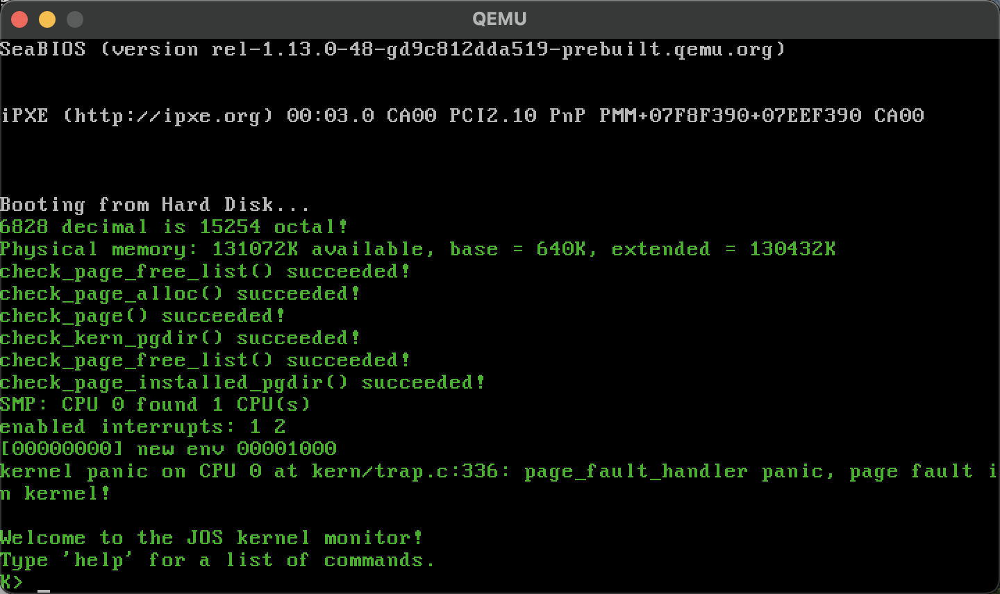
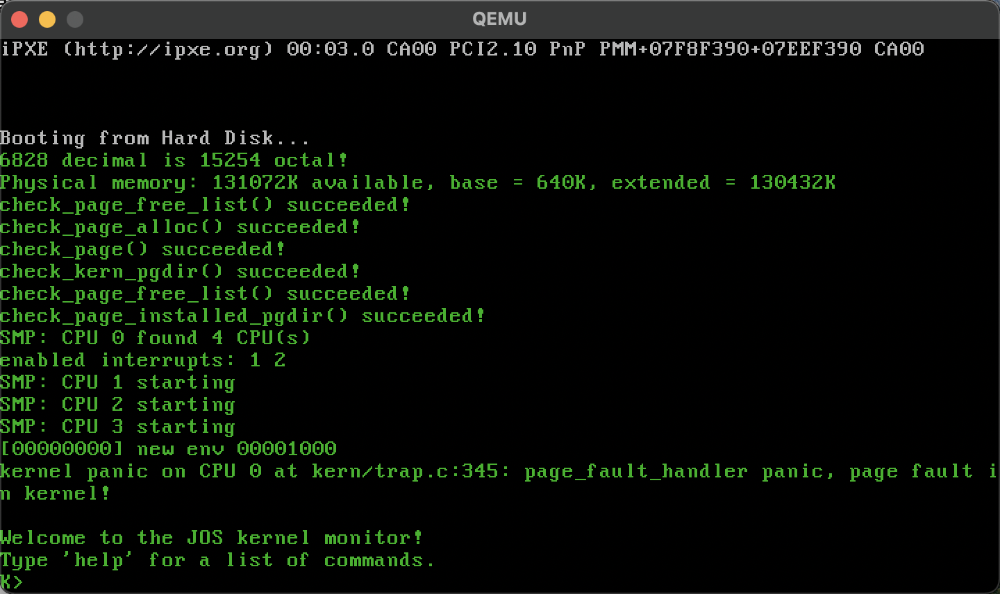
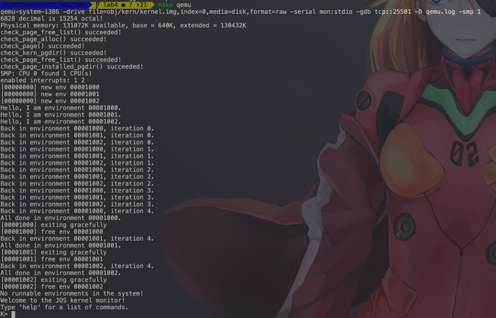
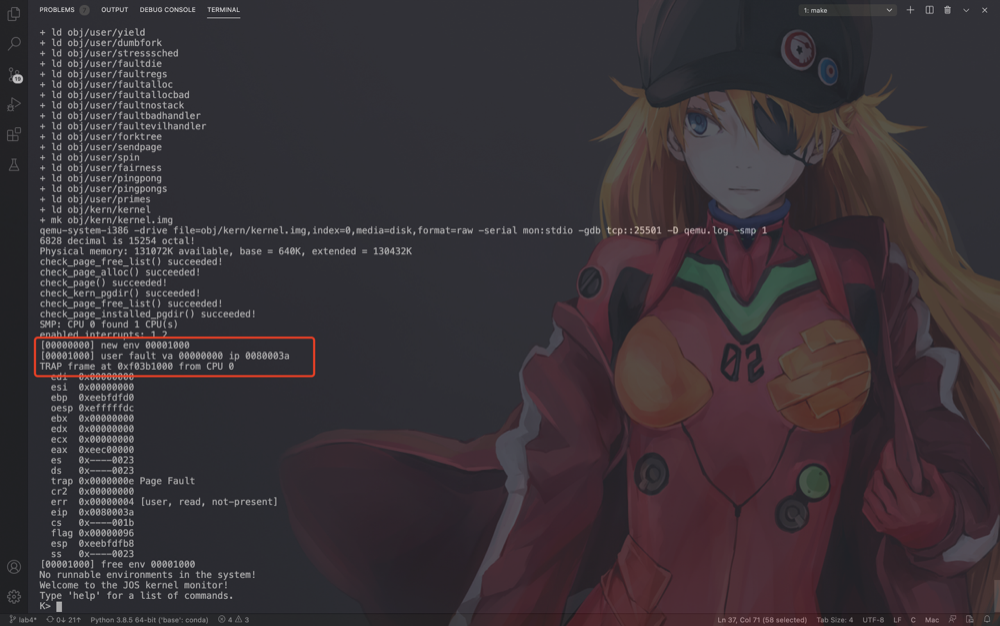
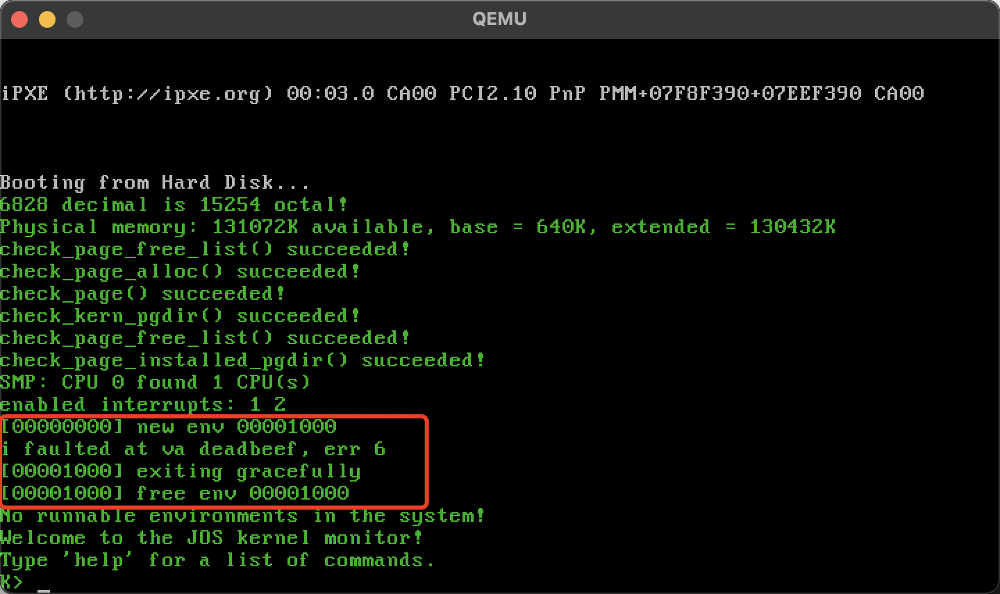
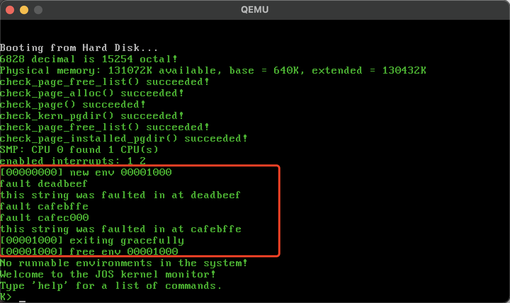
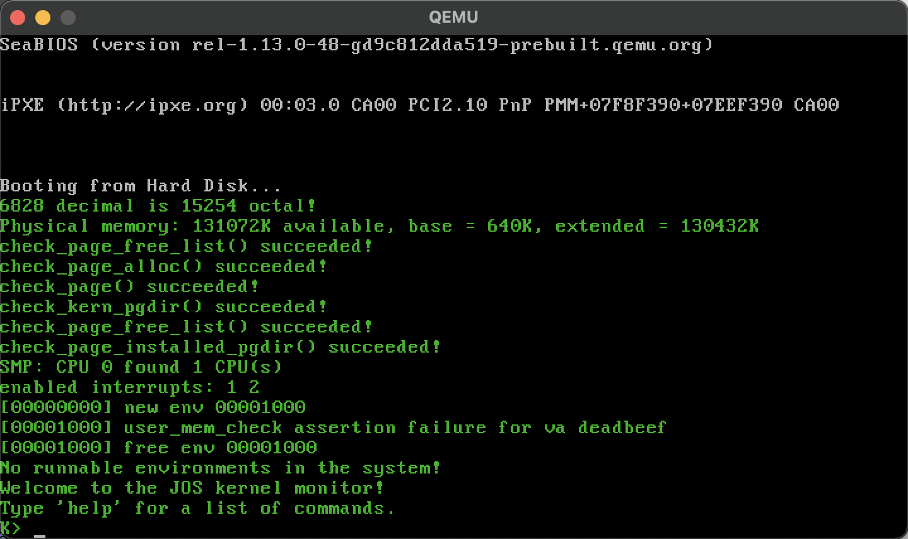
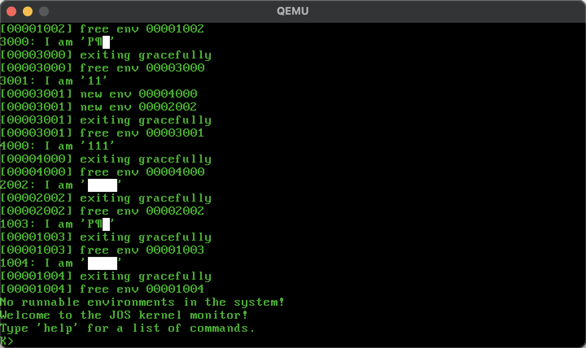
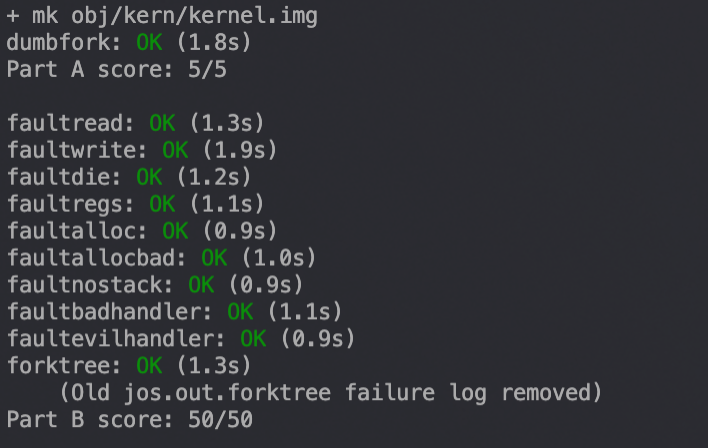

# LAB 4

*by Woooooow~ / start 2020/11/26*

发现助教从 [gatsbyd](https://github.com/gatsbyd/mit_6.828_jos_2018) 这里拿的源码, 那就毫不客气的学习一下? ( 不愧是 了不起的盖茨比 )

## Solution to Exercise

### Part A: Multiprocessor Support and Cooperative Multitasking

#### Exercise 1

> **Exercise 1.** Implement `mmio_map_region()` in *kern/pmap.c*. To see how this is used, look at the beginning of `lapic_init()` in *kern/lapic.c*. You'll have to do the next exercise, too, before the tests for `mmio_map_region()` will run.

LAPIC (Local Advanced Programmable Interrupt Controller) 是一堆由寄存器组成的某种处理 internal interrupt 的硬件 ( 每个物理 CPU 配备一个, 所以带了 local ). 在这个实验中我们用的这个 LAPIC 是通过将寄存器映射到物理内存中供 CPU 去访问. JOS 将 LAPIC 放在了 0xFE000000 这个物理内存空洞, 但是太高了, 因此要把它映射到 MMIOBASE 这个虚拟地址 ( 这里 [MMIOBASE, MMIOLIM) 留了 4MB 空间给 OS 作为 I/O hole 使用 ), 而 `mmio_map_region()` 就是用来做 mmio 的映射的.

这个函数给了很多提示, 唯一需要注意的是需要根据 ROUNDDOWN(pa) 后的 pa 重新判断 size. 再利用提示中提到的 `boot_map_region()` 函数进行地址映射 ( 这里要注意 `boot_map_region()` 函数的用法 ), 最后要注意的是, 这个函数在每个 AP 初始化的时候都要调度一次 ( 毕竟每个 processor 都有个 LAPIC, 因此每个 cpu 对应的 LAPIC 都要映射到 [MMIOBASE, MMIOLIM) 这里 ), 在函数的最后要将 base 的值更新, 然后返回旧值. 

```cpp
// boot_map_region() Usage:
// Map [va, va+size) of virtual address space to physical [pa, pa+size)
// in the page table rooted at pgdir.  Size is a multiple of PGSIZE, and
// va and pa are both page-aligned.
// Use permission bits perm|PTE_P for the entries.

void *
mmio_map_region(physaddr_t pa, size_t size)
{
    static uintptr_t base = MMIOBASE;

    size = ROUNDUP(pa + size, PGSIZE);
    pa = ROUNDDOWN(pa, PGSIZE);
    size -= pa;
    if(size + base >= MMIOLIM)
        panic("In kern/pmap.c:mmio_map_region():\n\treservation would overflow MMIOLIM!\n");

    boot_map_region(kern_pgdir, base, size, pa, PTE_PCD|PTE_PWT|PTE_W);

    base += size;

    return (void *)(base - size);
}
```

这里由于 base 被定义为 static 因此每次调用这个函数的时候 base 的值都是上次调用后的值. ( 恰好让下一个 LAPIC 映射在上一个的顶部 )

#### Exercise 2

> **Exercise 2.** Read `boot_aps()` and `mp_main()` in *kern/init.c*, and the assembly code in *kern/mpentry.S*. Make sure you understand the control flow transfer during the bootstrap of APs. Then modify your implementation of `page_init()` in *kern/pmap.c* to avoid adding the page at `MPENTRY_PADDR` to the free list, so that we can safely copy and run AP bootstrap code at that physical address. Your code should pass the updated `check_page_free_list()` test (but might fail the updated `check_kern_pgdir()` test, which we will fix soon).

这里由于我们要将所有的 AP entry 的代码映射到 `MPENTRY_PADDR` 上, 因此在 `page_init()` 中不能将这块地址标注为 free.

```cpp
void
page_init(void)
{
    unsigned int pg_begin = MPENTRY_PADDR / PGSIZE;
    size_t i;
    page_free_list = NULL;

    // calculate the allocatable memory (page index) in Extended memory
    size_t pgs_avail_extend = ((uint32_t) boot_alloc(0) - KERNBASE) / PGSIZE;

    pages[0].pp_ref = 1;
    pages[0].pp_link = NULL;
    pages[pg_begin].pp_ref = 1;
    pages[pg_begin].pp_link = NULL;
    for (i = 1; i < npages_basemem; i++) {
        if(i == pg_begin)
            continue;
        pages[i].pp_ref = 0;
        pages[i].pp_link = page_free_list;
        page_free_list = &(pages[i]);
    }
    for (i = npages_basemem; i < pgs_avail_extend; ++i){
        pages[i].pp_ref = 1;
        pages[i].pp_link = NULL;
    }

    for (i = pgs_avail_extend; i < npages; ++i){
        pages[i].pp_ref = 0;
        pages[i].pp_link = page_free_list;
        page_free_list = &pages[i];
    }

    return;
}
```

#### Exercise 3

> **Exercise 3.** Modify `mem_init_mp()` (in *kern/pmap.c*) to map per-CPU stacks starting at `KSTACKTOP`, as shown in *inc/memlayout.h*. The size of each stack is `KSTKSIZE` bytes plus `KSTKGAP` bytes of unmapped guard pages. Your code should pass the new check in `check_kern_pgdir()`.

从上面那一坨描述中提取关键信息:

- *kern/cpu.h* defines most of the per-CPU state, including `struct CpuInfo`, which stores per-CPU variables
- `cpunum()` always returns the ID of the CPU that calls it, which can be used as an index into arrays like cpus
- macro `thiscpu` is shorthand for the current CPU's `struct CpuInfo`
- `percpu_kstacks[NCPU][KSTKSIZE]` reserves space for `NCPU`'s worth of kernel stacks
- The TSS for CPU i is stored in `cpus[i].cpu_ts`, and the corresponding TSS descriptor is defined in the GDT entry `gdt[(GD_TSS0 >> 3) + i]`. The global `ts` variable defined in *kern/trap.c* will no longer be useful
- `cpus[cpunum()].cpu_env` (or `thiscpu->cpu_env`), which points to the environment currently executing on the current CPU (the CPU on which the code is running)

其中 `CpuInfo` 记录的分别是

```cpp
// Per-CPU state
struct CpuInfo {
    uint8_t cpu_id;                 // Local APIC ID; index into cpus[] below
    volatile unsigned cpu_status;   // The status of the CPU
    struct Env *cpu_env;            // The currently-running environment.
    struct Taskstate cpu_ts;        // Used by x86 to find stack for interrupt
};
```

`mem_init()` 里调用了 `mem_init_mp()` 函数来给每一个 CPU 的 kernel stack 映射. 这里只要照着 lab2 里面写的 bootstack 映射写就行了 ( 这个注释真的给力嗷 )

```cpp
static void
mem_init_mp(void)
{
    for(int i = 0; i < NCPU; ++i)
        boot_map_region(kern_pgdir, KSTACKTOP - i * (KSTKSIZE + KSTKGAP) - KSTKSIZE, KSTKSIZE,
        PADDR(percpu_kstacks[i]), PTE_W | PTE_P);
}
```

> 
>
> **Figure 4-1**

#### Exercise 44

> **Exercise 4.** The code in `trap_init_percpu()` (*kern/trap.c*) initializes the TSS and TSS descriptor for the BSP. It worked in Lab 3, but is incorrect when running on other CPUs. Change the code so that it can work on all CPUs. (Note: your new code should not use the global `ts` variable any more.)

这里是给每一个 CPU 的 tss 初始化 ( 给每个 CPU 一个 kernel task? ). `esp0`: 指代当前 CPU 的 stack 的起始位置. `ts_ss0 = GD_KD` 表示 esp0 这个位置存储的是 kernel 的 data. ts_iomb: I/O map base address field. 接下来是对对应的 gdt 表赋值. 注意到我们通过 `(GD_TSS0 >> 3) + thiscpu->cpu_id` 来得到对应的 gdt 表项.

最后的 ltr( load task register ) 非常迷惑. 由 ia32 manual 给的解释 *The LTR instruction loads a segment selector (source operand) into the task register that points to a TSS descriptor in the GDT* 我们知道 task register 就是某种 cache, visible part 大概是存储 gdt 的索引; invisible part 则存储着对应 gdt 中的 base 和 limit. ltr 对应的参数则是 task register 中可见的部分, 可是这里 visible part 到底是什么这本书却不写 ( 我只想说 Intel 垃圾 ). 后来找遍全网, 才发现这本 [IA32](https://learning.oreilly.com/library/view/The+Unabridged+Pentium+4+IA32+Processor+Genealogy/032124656X/032124656X_ch10lev1sec7.html#ch10fig06) 的书中配上了 task register 可见部分的结构 ( Figure 4-2 ), 才知道参数的末 3 bit 是 flag 位, 前 13 bit 则是 descriptor table index. 因此我们的代码需要根据对应的 CPU ID 来改变 ltr 的参数 `GD_TSS0 + (thiscpu->cpu_id << 3)`

> 
>
> **Figure 4-2**

```cpp
void
trap_init_percpu(void)
{
    // Setup a TSS so that we get the right stack
    // when we trap to the kernel.
    thiscpu->cpu_ts.ts_esp0 = KSTACKTOP - thiscpu->cpu_id * (KSTKSIZE + KSTKGAP);
    thiscpu->cpu_ts.ts_ss0 = GD_KD;
    thiscpu->cpu_ts.ts_iomb = sizeof(struct Taskstate); // we don't need to know what is it.

    // Initialize the TSS slot of the gdt.
    gdt[(GD_TSS0 >> 3) + thiscpu->cpu_id] = SEG16(STS_T32A, (uint32_t) (&(thiscpu->cpu_ts)),
                    sizeof(struct Taskstate) - 1, 0);
    gdt[(GD_TSS0 >> 3) + thiscpu->cpu_id].sd_s = 0;

    // The LTR instruction loads a segment selector (source operand) into the task register
    // that points to a TSS descriptor in the GDT
    ltr(GD_TSS0 + (thiscpu->cpu_id << 3));

    // Load the IDT
    lidt(&idt_pd);
}
```

> 
>
> **Figure 4-3**

#### Exercise 5

> **Exercise 5.** Apply the big kernel lock as described above, by calling `lock_kernel()` and `unlock_kernel()` at the proper locations.

- In `i386_init()`, acquire the lock before the BSP wakes up the other CPUs.
- In `mp_main()`, acquire the lock after initializing the AP, and then call `sched_yield()` to start running environments on this AP.
- In `trap()`, acquire the lock when trapped from user mode. To determine whether a trap happened in user mode or in kernel mode, check the low bits of the `tf_cs`.
- In `env_run()`, release the lock right before switching to user mode. Do not do that too early or too late, otherwise you will experience races or deadlocks.

这个里就是照着注释放函数, 没有特别的地方. 值得注意的是这里 spin lock 的实现就是书上写到的 `xchg` 这个原子操作.

#### Exercise 6

> Exercise 6. Implement round-robin scheduling in `sched_yield()` as described above. Don't forget to modify `syscall()` to dispatch `sys_yield()`.
>
> Make sure to invoke `sched_yield()` in `mp_main()`.
>
> Modify *kern/init.c* to create three (or more!) environments that all run the program *user/yield.c*.
>
> Run make qemu. You should see the environments switch back and forth between each other five times before terminating, like below.
>
> Test also with several CPUS: make qemu CPUS=2.
>
> ...
>
> Hello, I am environment 00001000.
>
> Hello, I am environment 00001001.
>
> Hello, I am environment 00001002.
>
> Back in environment 00001000, iteration 0.
>
> Back in environment 00001001, iteration 0.
>
> Back in environment 00001002, iteration 0.
>
> Back in environment 00001000, iteration 1.
>
> Back in environment 00001001, iteration 1.
>
> Back in environment 00001002, iteration 1.
>
> ...
>
> After the yield programs exit, there will be no runnable environment in the system, the scheduler should invoke the JOS kernel monitor. If any of this does not happen, then fix your code before proceeding.

`sched_yield()` 将找到下一个 runable 的进程并切换到这个进程上. 主要步骤如下:

- 从当前在 running 的进程 ( 也就是 curenv ) 开始 ( 如果 curenv 不存在, 则从数组首部开始查找 ), 顺序查找在 envs 数组 ( in circular fashion, 也就是要取模做个环状查找 ),  取出首个 status 为 `ENV_RUNNABLE` 的进程, 并调用 `env_run()` 唤醒取出的进程.
- 如果上述查询中没有找到任何一个 `ENV_RUNNABLE` 的进程, 则将观测 `curenv->env_status` 若其为 `ENV_RUNNING` 则继续运行这个进程.
- 若以上两种情况都没发生. 则自然的停止调度.
- 这个函数必须阻止同一个进程在两个不同 CPU 上运行的情况 ( 由于正在运行 env 的状态必定是 `ENV_RUNNING`, 在前述中不会发生这种事情 )

```cpp
void
sched_yield(void)
{
    struct Env *idle;

    int begin = 0;
    if(curenv)
        begin = ENVX(curenv->env_id);

    for(int i = 0; i < NENV; ++i){
        idle = envs + ((i + begin) % NENV);
        if(idle->env_status == ENV_RUNNABLE)
            env_run(idle);
    }

    if(curenv && curenv->env_status == ENV_RUNNING)
        env_run(curenv);

    // sched_halt never returns
    sched_halt();
}
```

同时由于题目要求我们将 dispatch `sys_yield()`, 因此要在 *kern/syscall.c*: `syscall()` 的 switch 语句中将它声明, 加入 syscall 大家庭... 最后再调整 *kern/init* 中 `i386_init()` 创建想要的进程 `ENV_CREATE(user_yield, ENV_TYPE_USER)` X3.

```cpp
// kern/syscall.c
int32_t
syscall(uint32_t syscallno, uint32_t a1, uint32_t a2, uint32_t a3, uint32_t a4, uint32_t a5)
{
    switch (syscallno) {
        case SYS_cputs:
            sys_cputs((char *)a1, (size_t)a2);
            return 0;
        case SYS_cgetc:
            return sys_cgetc();
        case SYS_getenvid:
            return sys_getenvid();
        case SYS_env_destroy:
            return sys_env_destroy((envid_t)a1);
        case SYS_show_environments:
            sys_show_environments();
            return 0;
        // new added
        case SYS_yield:
            sys_yield();
            return 0;
        case NSYSCALLS:
        default:
            return -E_INVAL;
    }
    panic("syscall not implemented");
}

// kern/init.c
void
i386_init(void)
{

    // ...

#if defined(TEST)
    ENV_CREATE(TEST, ENV_TYPE_USER);
#else
    // three yield.c
    ENV_CREATE(user_yield, ENV_TYPE_USER);
    ENV_CREATE(user_yield, ENV_TYPE_USER);
    ENV_CREATE(user_yield, ENV_TYPE_USER);
#endif // TEST*

    // ...

}
```

> 
>
> **Figure 4-4**

#### Exercise 7

> **Exercise 7.** Implement the system calls described above in *kern/syscall.c* and make sure `syscall()` calls them. You will need to use various functions in *kern/pmap.c* and *kern/env.c*, particularly `envid2env()`. For now, whenever you call `envid2env()`, pass 1 in the checkperm parameter. Be sure you check for any invalid system call arguments, returning `-E_INVAL` in that case. Test your JOS kernel with *user/dumbfork* and make sure it works before proceeding.
>
> `sys_exofork`:
> This system call creates a new environment with an almost blank slate: nothing is mapped in the user portion of its address space, and it is not runnable. The new environment will have the same register state as the parent environment at the time of the `sys_exofork` call. In the parent, `sys_exofork` will return the `envid_t` of the newly created environment (or a negative error code if the environment allocation failed). In the child, however, it will return 0. (Since the child starts out marked as not runnable, `sys_exofork` will not actually return in the child until the parent has explicitly allowed this by marking the child runnable using....)
>
> `sys_env_set_status`:
> Sets the status of a specified environment to `ENV_RUNNABLE` or `ENV_NOT_RUNNABLE`. This system call is typically used to mark a new environment ready to run, once its address space and register state has been fully initialized.
>
> `sys_page_alloc`:
> Allocates a page of physical memory and maps it at a given virtual address in a given environment's address space.
>
> `sys_page_map`:
> Copy a page mapping (not the contents of a page!) from one environment's address space to another, leaving a memory sharing arrangement in place so that the new and the old mappings both refer to the same page of physical memory.
>
> `sys_page_unmap`:
> Unmap a page mapped at a given virtual address in a given environment.

这几个函数基本上是看着注释中的提示就能写完整的, 唯一要注意的是要准确的写出各种错误判断 ( 比如 flag 位的判断, 以及各种位运算符等的优先级和作用域, 以及各种括号要看清楚... 我就被自己坑了 )

- `sys_exofork()`: fork 一个子进程, 但是把他的 status 设置为 `ENV_NOT_RUNNABLE`, 同时继承父进程的寄存器, 但是子进程寄存器中 `eax` 要置零 ( fork 在子进程中返回 0, 而返回值是由 trapfram 里面保存的寄存器 `eax` 从 kernel model 带回 user model 的 ), 最后在父进程中返回对应子进程的 `env_id`.

```cpp
// kern/trap.c: dispatch()
static void
trap_dispatch(struct Trapframe *tf)
{
// ...
case T_SYSCALL:
    tf->tf_regs.reg_eax = syscall(tf->tf_regs.reg_eax,
    tf->tf_regs.reg_edx, tf->tf_regs.reg_ecx,
    tf->tf_regs.reg_ebx, tf->tf_regs.reg_edi,
    tf->tf_regs.reg_esi);
    return;
// ...
}
```

```cpp
static envid_t
sys_exofork(void)
{
    struct Env *child_e;
    int error_code = env_alloc(&child_e, curenv->env_id);
    if(error_code < 0)
        return error_code;

    child_e->env_status = ENV_NOT_RUNNABLE;
    child_e->env_tf = curenv->env_tf;

    // from the current environment -- but tweaked so sys_exofork
    // will appear to return 0.
    child_e->env_tf.tf_regs.reg_eax = 0;

    return child_e->env_id;
}
```

- `sys_env_set_status()`: 就检查下传入的 `status` 是不是合法的 ( `(status != ENV_RUNNABLE) && (status != ENV_NOT_RUNNABLE)` ) 以及 envid 合不合法. 然后给对应的进程赋予给定的 `status`

```cpp
static int
sys_env_set_status(envid_t envid, int status)
{
    if((status != ENV_RUNNABLE) && (status != ENV_NOT_RUNNABLE))
        return -E_INVAL;

    struct Env *e;
    int error_code = envid2env(envid, &e, 1);
    if(error_code < 0)
        return error_code;

    e->env_status = status;

    return 0;
}
```

- `sys_page_alloc()`: 分配一个物理页并将其映射到指定进程的指定虚拟地址上, 注意 `perm` 的检测

```cpp
static int
sys_page_alloc(envid_t envid, void *va, int perm)
{
    // -E_INVAL if va >= UTOP, or va is not page-aligned.
    if((uintptr_t)va >= UTOP || (uintptr_t)va % PGSIZE)
        return -E_INVAL;

    // -E_INVAL if perm is inappropriate
    int flag = (PTE_U | PTE_P);
    if(perm & ~(PTE_SYSCALL) || ((perm & flag) != flag))
        return -E_INVAL;

    struct Env *e;
    int error_code = envid2env(envid, &e, 1);
    // -E_BAD_ENV if environment envid doesn't currently exist,
    // or the caller doesn't have permission to change envid.
    if(error_code < 0)
        return error_code;

    struct PageInfo *pginfo = page_alloc(ALLOC_ZERO);
    // -E_NO_MEM if there's no memory to allocate the new page,
    // or to allocate any necessary page tables.
    if(!pginfo)
        return -E_NO_MEM;

    error_code = page_insert(e->env_pgdir, pginfo, va, perm);
    // -E_NO_MEM if there's no memory to allocate the new page,
    // or to allocate any necessary page tables.
    if(error_code < 0){
        page_free(pginfo);
        return error_code;
    }

    return 0;
}
```

`sys_page_map()`: 将源进程中的某一 va 映射到目的进程中的 va, 从而实现内存共享

```cpp
static int
sys_page_map(envid_t srcenvid, void *srcva,
         envid_t dstenvid, void *dstva, int perm)
{
    if((uintptr_t)srcva >= UTOP || (uintptr_t)dstva >= UTOP ||
        (uintptr_t)srcva % PGSIZE || (uintptr_t)dstva % PGSIZE)
        return -E_INVAL;

    // -E_INVAL if perm is inappropriate
    int flag = (PTE_U | PTE_P);
    if(perm & ~(PTE_SYSCALL) || ((perm & flag) != flag))
        return -E_INVAL;

    struct Env *srce, *dste;
    int error_code = envid2env(srcenvid, &srce, 1);
    // -E_BAD_ENV if srcenvid and/or dstenvid doesn't currently exist,
    // or the caller doesn't have permission to change one of them.
    if(error_code)
        return error_code;
    error_code = envid2env(dstenvid, &dste, 1);
    if(error_code)
        return error_code;

    pte_t *srcpte;
    struct PageInfo *pginfo = page_lookup(srce->env_pgdir, srcva, &srcpte);
    // -E_INVAL is srcva is not mapped in srcenvid's address space.
    if(!pginfo)
        return -E_INVAL;

    // -E_INVAL if (perm & PTE_W), but srcva is read-only in srcenvid's
    // address space.
    if((! ((*srcpte) | PTE_W) ) && (perm | PTE_W))
        return -E_INVAL;

    // -E_NO_MEM if there's no memory to allocate any necessary page tables.
    error_code = page_insert(dste->env_pgdir, pginfo, dstva, perm);
    if(error_code)
        return error_code;

    return 0;
}
```

`sys_page_unmap()`: 删除到指定进程的指定虚拟地址的映射

```cpp
static int
sys_page_unmap(envid_t envid, void *va)
{
    // -E_INVAL if va >= UTOP, or va is not page-aligned.
    if((uintptr_t)va >= UTOP || (uintptr_t)va % PGSIZE)
        return -E_INVAL;

    struct Env *e;
    int error_code = envid2env(envid, &e, 1);
    if(error_code)
        return error_code;

    page_remove(e->env_pgdir, va);
    return 0;
}
```

最后在 kern/syscall.c: syscall() 中的 switch 加入对应 syscall

```cpp
// ...
case SYS_yield:
    sys_yield();
    return 0;
case SYS_exofork:
    return sys_exofork();
case SYS_env_set_status:
    return sys_env_set_status((envid_t)a1, (int)a2);
case SYS_page_alloc:
    return sys_page_alloc((envid_t)a1, (void*)a2, (int)a3);
case SYS_page_map:
    return sys_page_map((envid_t)a1, (void*)a2, (envid_t)a3, (void*)a4, (int)a5);
case SYS_page_unmap:
    return sys_page_unmap((envid_t)a1, (void*)a2);
// ...
```

### Part B: Copy-on-Write Fork

在 Part A 最后跑的 dumpfork 实现的是一个深拷贝, 即父进程创建子进程的同时将自己所有的内存数据全部 copy 了, 但这样做就非常浪费, 因此在 part B 中我们做的事情就实现一个前拷贝. 即让父进程和子进程共享一块物理内存, 直到某个进程修改了内存, 再调用 page fault 来 copy.

#### Exercise 8

> **Exercise 8.** Implement the `sys_env_set_pgfault_upcall` system call. Be sure to enable permission checking when looking up the environment ID of the target environment, since this is a "dangerous" system call.

在 part B 中, 我们将改变 JOS 之前的 `dumpfork()` ( 一个将父进程全部地址完整 copy 的 fork 函数 ), 将内存改为延迟写, 即 copy-on-write 的方式. 在 COW 的基础上, 无论父进程或子进程在改写共享页 ( COW page ) 的时产生的 page fault 都将有我们用户即 page fault handler  处理. 这里 fork 函数将通过一个叫 `sys_env_set_pgfault_upcall()` 的 system call 来告诉 kernel 他要调用的 page fault handler.

exercise 8 要实现的函数还是很简单的, 不要忘记加入 syscall 的 switch 语句中.

```cpp
static int
sys_env_set_pgfault_upcall(envid_t envid, void *func)
{
    struct Env *e;
    int error_code = envid2env(envid, &e, 1);
    if(error_code)
        return error_code;

    e->env_pgfault_upcall = func;
    return 0;
}
```

#### Exercise 9/10/11

> **Exercise 9.** Implement the code in `page_fault_handler` in *kern/trap.c* required to dispatch page faults to the user-mode handler. Be sure to take appropriate precautions when writing into the exception stack. (What happens if the user environment runs out of space on the exception stack?)
>
> **Exercise 10.** Implement the `_pgfault_upcall` routine in *lib/pfentry.S*. The interesting part is returning to the original point in the user code that caused the page fault. You'll return directly there, without going back through the kernel. The hard part is simultaneously switching stacks and re-loading the EIP.
>
> **Exercise 11.** Finish `set_pgfault_handler()` in *lib/pgfault.c*.

👴 吐了, 我看了一整天才搞懂这里的函数调用是怎么一回事.

要理解在 user model 下 JOS 是如何处理 page fault, 需要从 user 如何定义自己的 page fault handler 开始一步步研究出现 page fault 后函数的调用过程. 这里随便找了个文件 ( user/faultalloc.c ) 来举例.

```cpp
void
handler(struct UTrapframe *utf)
{
    // ...
}

void
umain(int argc, char **argv)
{
    set_pgfault_handler(handler);
    cprintf("%s\n", (char*)0xDeadBeef);
    cprintf("%s\n", (char*)0xCafeBffe);
}
```

这里 `umain()` 以函数指针 handler 作为参数调用函数 `set_pgfault_handler()` 设置了当前进程 ( curenv ) 的 page fault handler. 函数 `set_pgfault_handler()` 定义在 *lib/pgfault.c*, 文件中的全局变量 `_pgfault_handler` 这个函数指针将作为当前进程环境下的 page fault handler 函数的入口, 将在 *lib/pfentry.S* 中被调用. 而全局变量 `_pgfault_upcall` 则是定义在文件 *lib/pfentry.S* 由汇编写的函数, 其主要作用是作为进程调用自身 page fault handler 的通用接口, 并在函数内部调用真正的 page fault handler ( 也就是 `_pgfault_handler` ), 并且将处理 page fault 异常返回, 函数传参等工作 ( 之后会回来看这个函数的 ). 在 `set_pgfault_handler()` 中首先检测在当前进程环境下, 进程是否定义过 page fault handler. 在这里, 通过检测 `_pgfault_handler` 变量是否为 `NULL`. 若为 `NULL` 则表明该进程首次定义该进程环境下的 page fault handler, 则该进程还没有对应的 USER EXCEPTION STACK ( 这个 stack 类似于在处理 kernel interrupt 时候的 kernel stack 用来保存返回引起 interrupt/exception 用户进程所必须的信息, 之后在理解调用过程的时候会详细解释 ), 因此要通过 `sys_page_alloc()` 为该进程在  [UXSTACKTOP - PGSIZE, UXSTACKTOP) 这块虚拟内存这映射一个 page 作为当前进程的 USER EXCEPTION STACK. 同时将 `_pgfault_upcall` 这个函数指针作为进程 page fault handler 的通用调用接口, 通过系统调用 `sys_env_set_pgfault_upcall()` 赋值给当前进程的 `env_pgfault_upcall` ( Exception handling ).最后简单的将 `_pgfault_handler` 赋值为 `handler` ( 进程想要设置的新的 exception handler ), 等待发生 page fault 时 `_pgfault_upcall` 来调用它. 这里稍微注意下, 我们是通过系统调用 `sys_getenvid()` 来获得当前进程的 id 值.

```cpp
// lib/pgfault.c: set_pgfault_handler
void
set_pgfault_handler(void (*handler)(struct UTrapframe *utf))
{
    int r;

    if (_pgfault_handler == 0) {
        envid_t curenv_id = sys_getenvid();

        if((r = sys_page_alloc(curenv_id, (void*)(UXSTACKTOP - PGSIZE), PTE_P|PTE_U|PTE_W)) < 0)
            panic("allocating at %x in page fault handler: %e", UXSTACKTOP - PGSIZE, r);

        if((r = sys_env_set_pgfault_upcall(curenv_id, _pgfault_upcall)) < 0)
            panic("set_pgfault_handler call sys_env_set_pgfault_upcall: %e", r);
    }

    _pgfault_handler = handler;
}
```

那末, 用户进程在执行的过程中出现了 page fault 会发生甚么事呢? 首先像进程引发其他的 exception 一样经过一系列调用最后来到 `trap_dispatch()` 函数, 通过检查 trapfram 里的 tf_trapno 辨识出这个异常是由 缺页引起的, 因此会调用 定义在同一文件下的 `page_fault_handler()` 函数. 这里, 函数首先检测处这是个在用户态引起的缺页错误 ( 通过 `(tf->tf_cs & 0x3) == 0` ), 之后在观察该用户进程是否定义了自己的 page fault handler ( 也就是看看当前进程 env_pgfault_upcall 是不是空指针, 即 `curenv->env_pgfault_upcall == NULL`, 若为空则没有定义, 反之相反 ), 没有定义特定的缺页异常处理函数就简单的销毁这个进程, 并且打印相关资料 ( trapfram 里面的东西啥的 ).

若这个进程定义了自己的 page fault handler, 则正式开始调用用户态的异常处理函数. 这里会在 [UXSTACKTOP - PGSIZE, UXSTACKTOP) 这里加入 `UTrapframe` 这个结构, 然后将从 *用户态的异常处理函数* 返回到 *引起异常的函数* 所必须的信息放进这里面, 也就是此时的 `tf` 里面的值. 然后改变此时 `tf` 的 eip, 让他指向该用户进程定义的 page fault handler, 也就是 `curenv->env_pgfault_upcall` ( aka `_pgfault_upcall` ), 然后让进程栈指向刚才定义的 `UTrapframe`( 也就是 `tf->tf_esp = utf` ), 这时立刻调用 `env_run()` 从 kernel 中返回用户进程, 然而这里将不会像普通的 exception 一样返回到引起异常的指令, 而是从 `_pgfault_upcall` 对应的指令开始执行 ( 要知道 kernel 返回用户态是通过查找 tf 中保存的 eip 得到所需执行的指令所在位置, 然而在 `page_fault_handler()` 函数中我们改变了 tf 的 eip, 因此返回后理所当然的从当前 eip 对应的代码段 `_pgfault_upcall` 开始运行 ). 同时这时进程的 stack top 已经成为 `UTrapframe` 所在的地址.

这里要注意的是, 保存在区间 [UXSTACKTOP - PGSIZE, UXSTACKTOP) 中的每个 `UTrapframe` 之间**至少**要有 4B 的间隔 ( 间隔比 4B 多肯定没有问题啦, 只是比较浪费空间, 毕竟用户的异常处理栈大小只有一页, 超过这一页就是连 kernel 都不能读写的虚拟地址 ), 这将在发生递归缺页错误时用于保存函数返回地址 ( eip ). `UTrapframe` 里面没有保存 `cs` `ds` 这类寄存器是因为它是用来从用户进程的某个函数跳转到同一用户进程的另一函数, 因此不需要寻址 ( 找他的代码段, pgdir 什么的 ).

```cpp
void
page_fault_handler(struct Trapframe *tf)
{
    uint32_t fault_va;

    // Read processor's CR2 register to find the faulting address
    fault_va = rcr2();

    if ((tf->tf_cs & 0x3) == 0)
        panic("page_fault_handler panic, page fault in kernel!\n");

    if(curenv->env_pgfault_upcall == NULL){
        // Destroy the environment that caused the fault.
        cprintf("[%08x] user fault va %08x ip %08x\n",
            curenv->env_id, fault_va, tf->tf_eip);
        print_trapframe(tf);
        env_destroy(curenv);
    }

    struct UTrapframe *utf;
    uintptr_t UtfAddress;
    size_t size = sizeof(struct UTrapframe) + sizeof(uint32_t);

    if(tf->tf_esp >= UXSTACKTOP - PGSIZE && tf->tf_esp < UXSTACKTOP)
        UtfAddress = tf->tf_esp - size;
    else
        UtfAddress = UXSTACKTOP - size;

    user_mem_assert(curenv, (void*)UtfAddress, size, PTE_P|PTE_U|PTE_W);
    utf = (struct UTrapframe*)UtfAddress;

    utf->utf_fault_va = fault_va;
    utf->utf_eflags = tf->tf_eflags;
    utf->utf_eip = tf->tf_eip;
    utf->utf_err = tf->tf_err;
    utf->utf_esp = tf->tf_esp;
    utf->utf_regs = tf->tf_regs;

    tf->tf_eip = (uintptr_t)curenv->env_pgfault_upcall;
    tf->tf_esp = (uintptr_t)utf;
    env_run(curenv);
}
```

下图是 user exceptional stack 中的首个 `UTrapframe`, 当然首个 user trapfram 是不没必要在头部保存 4B 空间的, 但是懒得改 `page_fault_handler()` 里 `size` 代码 ( 这样代码看起来好看, 嗯 ). 当 user exception stack 有多个 `UTrapframe` 的时候, 除了首个 utf 中的 esp 回指最初引起缺页错误的函数, 其余的全都指向前一个 utf ( 也就是前一个 utf 中 fault_va 的地址, 不会这都有人不懂吧, 不会吧不会吧 )

```cpp
/*
 *          |<--------4B---------->|
 *          +----------------------+  <--- UXSTACKTOP
 *          |     reserved 4B      |
 *          +----------------------+
 *    +---  |    caller's esp      |
 *    |     +----------------------+
 *    |     |        eflag         |
 *    |     +----------------------+
 *    |     |         eip          |
 *    |     +----------------------+  ----+ <-- start of struct PushRegs
 *    .     |         eax          |      |
 *    .     +----------------------+      |
 *    .     |         ecx          |      |
 *    V     +----------------------+      |
 * The Real |         edx          |      |
 * Caller   +----------------------+      |
 * Stack    |         ebx          |      |
 *          +----------------------+    8 * 4B(reg)
 *          |         oesp         |      |
 *          +----------------------+      |
 *          |         ebp          |      |
 *          +----------------------+      |
 *          |         esi          |      |
 *          +----------------------+      |
 *          |         edi          |      |
 *          +----------------------+  ----+
 *          |         err          |
 *          +----------------------+
 *          |      fault_va        |
 *          +----------------------+  <---- %esp when handler is run
*/
```

( 注意从现在开始, 我们又回到 user model 了. 即我们将在 user model 下处理这个缺页异常 ) 通过上面对比 user trapfram 在 user exceptional stack 中的图像我们可以快速完善 `_pgfault_upcall` 函数. 这个函数前面四行在调用用户进程自定义的缺页异常处理函数, 其中 `pushl %esp` 将 utf 地址作为参数传递给了异常处理函数.

后面跟着的 5 行首先将 utf 保存的 caller 的 esp 赋值给 edi ( 这里可以是任意一个通用寄存器 ), 并将所得的值减去 4 ( 这里是在原来的 esp 下方留一个 4B 空间给 eip ) 然后再将所得值覆盖原先的 esp, 同时将 edi 放入 edi 指向的地址.

之后就是简简单单的回收通用寄存器和 eflag 最后让 esp 恢复调用者 esp - 4 以及 ret

```pl
.text
.globl _pgfault_upcall
_pgfault_upcall:
    # Call the C page fault handler.
    pushl %esp          # function argument: pointer to UTF
    movl _pgfault_handler, %eax
    call *%eax
    addl $4, %esp       # pop function argument

    movl 48(%esp), %edi
    subl $4, %edi
    movl %edi, 48(%esp)
    movl 40(%esp), %esi
    movl %esi, (%edi)

    # Restore the trap-time registers.  After you do this, you
    # can no longer modify any general-purpose registers.
    addl $8, %esp
    popal

    # Restore eflags from the stack.  After you do this, you can
    # no longer use arithmetic operations or anything else that
    # modifies eflags.
    addl $4, %esp
    popfl

    # Switch back to the adjusted trap-time stack.
    popl %esp

    # Return to re-execute the instruction that faulted.
    ret
```

> 
>
> **`make run-faultread`**
>
> 
>
> **`make run-faultdie`**
>
> 
>
> **`make run-faultalloc`**
>
> 
>
> **`make run-faultallocbad`**

#### Exercise 12

> **Exercise 12.** Implement `fork`, `duppage` and `pgfault` in *lib/fork.c*.
>
> Test your code with the `forktree` program. It should produce the following messages, with interspersed 'new env', 'free env', and 'exiting gracefully' messages. The messages may not appear in this order, and the environment IDs may be different.
>
> ```sh
>   1000: I am ''
>   1001: I am '0'
>   2000: I am '00'
>   2001: I am '000'
>   1002: I am '1'
>   3000: I am '11'
>   3001: I am '10'
>   4000: I am '100'
>   1003: I am '01'
>   5000: I am '010'
>   4001: I am '011'
>   2002: I am '110'
>   1004: I am '001'
>   1005: I am '111'
>   1006: I am '101'
> ```

太阴间了, 这个 lab 做的我绝望... exercise 12 从那个函数开始写都一样...烦 🙂️ 也可能是写的时候太累了什么的.

`pgfault()`: 这个函数首先检查 `utf` 里面的 `err` 是不是由写引起的 `err & FEC_WR`. 再看下引起错误的地址对应的 page 是不是 copy-on-writ. 如果引起 page fault 的原因是进程尝试对 cow 的内存进行写操作, 这个 handler 函数将调用 `sys_page_alloc`, 将一个空白内存映射到一个暂时的虚拟内存 `PFTEMP` 上 ( 并且将其 flag 设置为进程可读可写 ), 之后将引起错误的那块 page ( 也就是 `addr` )内的内容全部复制到新映射的 page 上, 最后将新映射地址对应的物理内存, 映射到 addr 上, 完成 copy 动作. 最后将, 对 `PFTEMP` 的映射解开.

这里需要注意的是, addr 是没有对齐的, 对齐操作前最后将其向下与 `PGSIZE` 对齐.

```cpp
static void
pgfault(struct UTrapframe *utf)
{
    void *addr = (void *) utf->utf_fault_va;
    uint32_t err = utf->utf_err;
    int r;

    addr = ROUNDDOWN(addr, PGSIZE);

    if(!(err & FEC_WR))
        panic("lib/fork.c: pgfault error Not FEC_WR");

    if(!(uvpt[(uintptr_t)PGNUM(addr)] & PTE_COW))
        panic("lib/fork.c: pgfault error Not PTE_COW");

    int perm = PTE_P|PTE_U|PTE_W;
    envid_t envid = sys_getenvid();
    if((r = sys_page_alloc(envid, (void*)PFTEMP, perm)) < 0)
        panic("lib/fork.c: pgfault sys_page_alloc error: %e", r);

    memcpy((void*) PFTEMP, (void*)addr, PGSIZE);

    if((r = sys_page_map(envid, (void*)PFTEMP, envid, addr, perm)) < 0)
        panic("lib/fork.c: pgfault sys_page_map error: %e", r);

    if((r = sys_page_unmap(envid, (void*)PFTEMP)) < 0)
        panic("lib/fork.c: pgfault sys_page_unmap error: %e", r);
}
```

`duppage()`: 无功无过? 三个函数中最为淳朴的函数? 就是将当前进程的第 `pn` 页映射到给定进程 `envid` 中. 如果当前进程的 `pn` 页是可写的或 cow 就让 map 的 perm 设为 cow. 其余就只读 map. 比较奇怪的是对于已经是 cow 的页面为什么还要重新映射一遍. 我猜是在做前一个 map 的时候可能会写 cow 页面, 导致当前进程调用 `pgfault` 让原来是 cow 的页面变成了 `PTE_W` ~~于是只好用花呗~~, 所以保险的再重新给这个页面上个 cow 标志.

> The ordering here (i.e., marking a page as COW in the child before marking it in the parent) actually matters! Can you see why? Try to think of a specific case where reversing the order could cause trouble.
>
> 
>
> **Figure 4-6**

对于上面那个问题的原因和前一段提到的猜想是一样的 ( 当然可以验证, 跑下 forktree 就会发现跑出的结果是错的, or 跑不出, 上面是我改了个顺序跑出来的结果, 看起来还是很奇妙的. )

```cpp
static int
duppage(envid_t envid, unsigned pn)
{
    int r;
    envid_t curenvid = sys_getenvid();
    uintptr_t va = pn * PGSIZE;
    int perm = PTE_P|PTE_U;

    if((uvpt[pn] & PTE_W) || (uvpt[pn] & PTE_COW)){
        if((r = sys_page_map(curenvid, (void*)va, envid, (void*)va, perm|PTE_COW)) < 0)
            return r;
        if((r = sys_page_map(curenvid, (void*)va, curenvid, (void*)va, perm|PTE_COW)) < 0)
            return r;
    }
    else
        if((r = sys_page_map(curenvid, (void*)va, envid, (void*)va, perm)) < 0)
            return r;

    return 0;
}
```

`fork()`: 相当糟心的函数， 虽然这个练习我找 addr 没有对齐这个 bug 花了很长时间, 但 fork 函数写得我很不开心 ( 主要是不知道怎么写 ). 在 `fork()` 一开始, 就设置好 page fault handler `set_pgfault_handler(pgfault)`, 之后再调用 `sys_exofork()` 函数得到一个不能 run 的子进程. 如果此时返回的是子函数, 则将他的 thisenv 设置为他所对应的 env ( 有一说一, 我已经忘记了这个 thisenv 是什么了, 我单纯的从文件中搜索了下 thisenv 发现之前我都是用同一个方法利用他的, 这次果然也是用这个方法. ), 然后返回 0 ( 这里子进程已经 running 了, 也就是此时父进程肯定跑肯完了 fork 后面的语句 ). 之后便是将父进程地址空间中 `USTACKTOP` 一下的地址 ( 当然是存在的,  即 `PTE_P` 的地址啦 ) 全部 map 到新生成的子进程中 ( 利用前面写的 `duppage()` ). 由于进程异常处理栈不能设置为 cow ( 设置成 cow 后怎么如何解 page fault？ ), 因此要直接用 `sys_page_alloc()` 给子进程在对应位置分配一个专属的 user exception stack. 最后直接用系统调用 `sys_env_set_pgfault_upcall` 将当前进程的页错误处理函数入口 `_pgfault_upcall` 传给子进程. 让子进程拥有和父进程一样的 page fault handler, 再这之后将子进程状态注册为 Runnable 就可以了. 哦, 返回子进程进程 id.

```cpp
envid_t
fork(void)
{
    int r;

    set_pgfault_handler(pgfault);

    envid_t envid = sys_exofork();

    if(envid < 0)
        return envid;

    if(envid == 0){
        thisenv = &envs[ENVX(sys_getenvid())];
        return 0;
    }

    for(uintptr_t i = 0; i < USTACKTOP; i += PGSIZE){
        if(!(uvpd[i >> PDXSHIFT] & PTE_P) || !(uvpt[PGNUM(i)] & PTE_P))
            continue;
        if((r = duppage(envid, PGNUM(i))) < 0)
            return r;
    }

    if((r = sys_page_alloc(envid, (void*)(UXSTACKTOP - PGSIZE), PTE_P|PTE_U|PTE_W)) < 0)
        return r;

    extern void _pgfault_upcall(void);
    if((r = sys_env_set_pgfault_upcall(envid, _pgfault_upcall)) < 0)
        return r;

    if((r = sys_env_set_status(envid, ENV_RUNNABLE)) < 0)
        return r;

    return envid;
}
```

忘了提一下这里非常 tricky 的技术细节 `uvpt[]`. lab 3 里面我们曾做过将当前进程的 pgdir 映射到 UVPT 这个地址. 也就是 pgdir 中有一个表项是指向自己的 ( 这个细节好难描述啊, 不如我就说下 UVPT 地址中装了什么东西 ). `uvpt[]` 是个长为 $2^{20}$ 的 4B 数组, 数组中的第 i 号 ( $0 ≤ i < 2^{20}$  ) 存的是第 i 个 PTE( 没错 page table entry ), 这样可以让进程中的程序快速查询每个 PTE 的状态 ( 比如可读可写 or 在 cow 状态? ).

举个例子, 假设每个虚拟地址 va 可以写作 $va = (D, T, O)$ 三元组 ( 其中 D 代表 va 的 PDX, T 代表 PTX, O 代表 offset, 参照 inc/mmu.h ). 因此令 uvpt = (uvptD, 0, 0 ), 现在要找某个虚拟地址 va = (D, T, O) 所对在的 page 是否可写. 这里就简单访问下在虚拟地址 (uvptD, D, T, b'00), 就可以得到对应 page 的 PTE ( Woooooow 好神奇~ ). 但是为什么? 因为这里我们通过 env_pgdir\[uvptD\] 找到的存放 PTE page 还是 env_pgdir, 所以我们访问虚拟地址 (uvptD, D, T, b'00) 时其实会比正常查找浅一个深度 ( 也就是找到 PTE 所在 page 在这个 page 上 offset ), 感觉讲不清楚, 是我太菜了...

> 
>
> **Figure 4-7**
>
> 到这里 Part B 搞定了... 淦, 做了两个 part 就花了我四个整天? 👴 还有好多事没做 ( 为什么所有 ddl 都在 12.15 号左右啊啊啊啊啊啊~ 这是给我上坟的日子嘛? )

### Part C: Preemptive Multitasking and Inter-Process communication (IPC)

